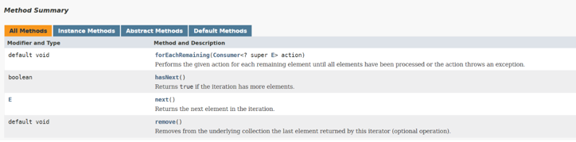
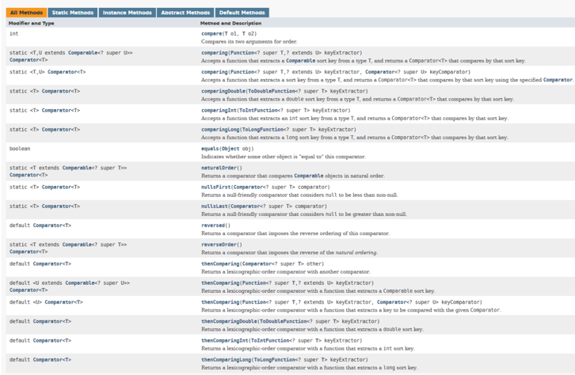

<details>
<summary>forEachRemaining() in Iterator</summary>

Explains the `forEachRemaining()` method, which was introduced in the iterator class in Java 8.

`Iterator` is an interface available in the `Collections` framework in `java.util package`. It is used to iterate a collection of objects. This interface has four methods, as shown in the below image. Before Java 8, the `forEachRemaining()` method did not exist.



Below is a simple program to iterate a list using iterator before Java 8.

```java
import java.util.ArrayList;
import java.util.Iterator;
import java.util.List;

public class IteratorDemo {
    public static void main(String[] args) {
        List<String> fruits = new ArrayList<>();
        fruits.add("Apple");
        fruits.add("Banana");
        fruits.add("Grapes");
        fruits.add("Orange");
        
        Iterator<String> iterator = fruits.iterator();

        while (iterator.hasNext()) {
            System.out.println(iterator.next());
        }
    }
}
```

#### Output

```
Apple
Banana
Grapes
Orange
```

The above example requires a `while` loop in order to iterate through the input list via an `Iterator`. To avoid this, the `forEachRemaining()` method was introduced in Java 8. This method takes in a `Consumer` instance as a parameter.

The `Consumer` interface section mentioned that the `Consumer` interface takes in a parameter and does not return anything. This is what we require for our iterator. Below is the same example shown above, but this time we are using the `forEachRemaining()` method.

```java
import java.util.ArrayList;
import java.util.Iterator;
import java.util.List;

public class IteratorDemo {
    public static void main(String[] args) {
        List<String> fruits = new ArrayList<>();
        fruits.add("Apple");
        fruits.add("Banana");
        fruits.add("Grapes");
        fruits.add("Orange");

        Iterator<String> iterator = fruits.iterator();

        iterator.forEachRemaining((fruit) -> System.out.println(fruit));
    }
}
```

#### Output

```
Apple
Banana
Grapes
Orange
```

The main purpose of introducing the `forEachRemaining()` method was to make the iteration code more concise and readable.

---

The next section discusses improvements in the `Map` API.

</details>


<details>
<summary>Map API Improvements: Fetch Operations</summary>

Explains the new methods added in the `Map` API for fetch operations.

The following topics are covered:
- `getOrDefault()`
- `putIfAbsent()`
- `compute()`, `computeIfAbsent()`, and `computeIfPresent()`

If you have used `Map` then you must have faced a challenge where you needed to update the value of a key in the `Map`. Now, before updating, you must first check if the value is present in the `Map`, get the current value, update it, and again put the value in the `Map`. This is quite a cumbersome process, and it involves using lots of `if`/`else` statements. This kind of code is difficult to understand and fix if any issues occur.

Thankfully, Java 8 has introduced some new methods in the `Map` interface to make our lives easier. This section discusses some of those new methods.

### 1. `getOrDefault()`

This method is a lifesaver if you need to update a certain key in the `Map`. The `getOrDefault()` method either returns the value of the key, or it returns the default value if the key is not present.

```java
import java.util.HashMap;
import java.util.Map;

public class MapUpgrades {
    public static void main(String[] args) {
        Map<String, Integer> items = new HashMap<>();
        items.put("perfume", 20);

        /*
         * Add 20 items to the map.
         * Below line will throw NullPointerException if key doesn't exist in the map.
         */
        // items.put("genius", items.get("genius") + 20);

        // This is the correct way to update a map value *before Java 8*.
        if (items.containsKey("genius")) { items.put("genius", items.get("genius") + 20); }
        else { items.put("genius", 20); }

        System.out.println(items);
    }
}
```

#### Output

```
{genius=20, perfume=20}
```

Below is the same example using the `getOrDefault()` method. Now we don't need the `if`/`else` checks to update a value in the `Map`.

```java
import java.util.HashMap;
import java.util.Map;

public class MapUpgrades {
    public static void main(String[] args) {
        Map<String, Integer> fruits = new HashMap<>();
        fruits.put("perfume", 20);
        fruits.put("genius", fruits.getOrDefault("genius", 0) + 20);
        System.out.println(fruits);
    }
}
```

#### Output

```
{genius=20, perfume=20}
```

### 2. `putIfAbsent()`

You might be aware that the `put()` method in `Map` either inserts a key-value pair in the `Map` or updates the value if the key is already present. Now, what if you don't want to update the value in the `Map`. You want to insert a key-value pair only if it is not present in the `Map`.

This can be achieved by the `putIfAbsent()` method. This method inserts a key and value in the `Map` only if it is not present. Let's look at how it works in the example below.

```java
import java.util.HashMap;
import java.util.Map;

public class MapUpgrades {
    public static void main(String[] args) {
        Map<String , Integer> items = new HashMap<>();
        items.put("perfume", 20);
        System.out.println(items.get("perfume"));
        items.putIfAbsent("perfume", 30);  // No effect.
        System.out.println(items.get("perfume"));
    }
}
```

#### Output

```
20
20
```

### 3. `compute()`, `computeIfAbsent()`, and `computeIfPresent()`

The `compute()` method computes a new mapping given the key and its existing value. This method returns the computed value. If the key is not present in the map, then an exception is thrown.

```java
import java.util.HashMap;
import java.util.Map;

public class ComputeExample {
    public static void main(String[] args) {
        Map<String, Integer> fruits = new HashMap<>();
        fruits.put("apple", 20);
    
        int val = fruits.compute("apple", (k, v) -> v + 10);
    
        System.out.println(val);
        // Below line will throw Null Pointer Exception.
        // val = fruits.compute("banana", (k, v) -> v + 10);
    }
}
```

### Output

```
30
```

The `computeIfAbsent()` method returns:
- The original value if the key is already present in the map.
- The computed value if the key is not present in the map.

This method takes a key and a `Function` as a parameters.

```java
import java.util.HashMap;
import java.util.Map;

public class ComputeIfAbsentExample {
    public static void main(String[] args) {
        Map<String, Integer> fruits = new HashMap<>();
        fruits.put("apple", 20);
    
        int val = fruits.computeIfAbsent("apple", v -> 10);
        System.out.println(val);
        
        val = fruits.computeIfAbsent("banana", v -> 10);
        System.out.println(val);
    }
}
```

#### Output

```
20
10
```

The `computeIfPresent()` method returns:
- A `null` value if the key is not present in the map.
- The computed value if the key is present in the map.

This method takes a key and a `BiFunction` as parameters.

```java
import java.util.HashMap;
import java.util.Map;

public class ComputeIfPresentExample {
    public static void main(String[] args) {
        Map<String, Integer> fruits = new HashMap<>();
        fruits.put("apple", 20);
    
        Integer val = fruits.computeIfPresent("apple", (k, v) -> v + 10);
        System.out.println(val);
        
        val = fruits.computeIfPresent("banana", (k, v) -> v + 10);
        System.out.println(val);
    }
}
```

#### Output

```
30
null
```

---

The next section discusses more improvements done to the `Map` interface.

</details>


<details>
<summary>Map API Improvements: Replace Operations</summary>

Explains the new methods for value replacement that have been added to `Map` API.

The following topics are covered:
1. `replace()`, `replaceAll()`, and `remove()`
   - `replace(K key, V value)`
   - `replace(K key, V oldValue, V newValue)`
   - `replaceAll(BiFunction<? super K, ? super V, ? extends V> function)`
   - `remove(Object key)`
   - `remove(Object key, Object value)`
2. Iterating over the `Map` using `forEach()`

In the previous section, we discussed a few new methods that have been added to the `Map` interface. In this section, we will look at some more improvements that have been done in `Map` API.

### 1. `replace()`, `replaceAll()`, and `remove()`

Sometimes we are required to change certain values in a `HashMap`. Before Java 8, the only way to do this was to iterate over the `Map` and change each value one-by-one.

This is a cumbersome process, and it is prone to errors if the logic is not written properly. To overcome this issue, a few new methods have been introduced in Java 8.

### a) `replace(K key, V value)`

This method replaces the entry for the specified key only if it is currently mapped to some value. If the key is not present or if the key is present but the current value is `null`, then nothing is done.

```java
import java.util.HashMap;
import java.util.Map;

public class MapImprovements {
    public static void main(String[] args) {
        Map<String, Integer> fruits = new HashMap<>();
        fruits.put("apple", 20);
        fruits.put("banana", 20);

        fruits.replace("apple", 50);

        System.out.println(fruits.get("apple"));
    }
}
```

#### Output

```
50
```

### b) `replace(K key, V oldValue, V newValue)`

This method replaces the entry for the specified key only if it is currently mapped to the specified value.

```java
import java.util.HashMap;
import java.util.Map;

public class MapImprovements {
    public static void main(String[] args) {
        Map<String, Integer> fruits = new HashMap<>();
        fruits.put("apple", 20);
        fruits.put("banana", 20);

        fruits.replace("apple", 30, 50);

        System.out.println(fruits.get("apple"));

        fruits.replace("apple", 20, 50);

        System.out.println(fruits.get("apple"));
    }
}
```

#### Output

```
20
50
```

### c) `replaceAll(BiFunction<? super K, ? super V, ? extends V> function)`

This method replaces each entry's value with the result of invoking the given function on that entry until all of the entries have been processed or the function throws an exception.

```java
import java.util.HashMap;
import java.util.Map;

public class MapImprovements {
    public static void main(String[] args) {
        Map<String, Integer> fruits = new HashMap<>();
        fruits.put("apple", 20);
        fruits.put("banana", 20);

        fruits.replaceAll((k, v) -> 50);  //Value becomes 50 for all keys

        System.out.println(fruits.get("apple"));
        System.out.println(fruits.get("banana"));
    }
}
```

#### Output

```
50
50
```

### d) `remove(Object key)`

This method removes the mapping for a key from this `Map` if it is present.

```java
import java.util.HashMap;
import java.util.Map;

public class MapImprovements {
    public static void main(String[] args) {
        Map<String, Integer> fruits = new HashMap<>();
        fruits.put("apple", 20);
        fruits.put("banana", 20);

        fruits.remove("apple");  // apple will be removed

        System.out.println(fruits.get("apple"));
    }
}
```

#### Output

```
null
```

### e) `remove(Object key, Object value)`

This method removes the entry for the specified key only if it is currently mapped to the specified value.

```java
import java.util.HashMap;
import java.util.Map;

public class MapImprovements {
    public static void main(String[] args) {
        Map<String, Integer> fruits = new HashMap<>();
        fruits.put("apple", 20);
        fruits.put("banana", 20);

        fruits.remove("apple" , 30);  // apple will not be removed because the value is 20
        System.out.println(fruits.get("apple"));

        fruits.remove("apple" , 20);  // apple will be removed
        System.out.println(fruits.get("apple"));
    }
}
```

#### Output

```
20
null
```

### 2) Iterating over the map using `forEach()`

Before Java 8, if you needed to iterate over a `HashMap`, then there were quite a few ways to do so, like getting the `keySet()` or `entrySet()`. However, these methods were not very flexible and needed some practice to get a hold of.

Now you can easily iterate over a `Map` using the `forEach()` method added in Java 8.

Here is the syntax of the `forEach()` method.

`forEach(BiConsumer<? super K,? super V> action)`

It takes a `BiConsumer` as a parameter.

```java
import java.util.HashMap;
import java.util.Map;

public class MapImprovements {
    public static void main(String[] args) {
        Map<String, Integer> fruits = new HashMap<>();
        fruits.put("apple", 10);
        fruits.put("banana", 20);
        fruits.put("orange", 30);

        fruits.forEach((k,v) -> System.out.println("Key: " + k + " Value: " + v));
    }
}
```

#### Output

```
Key: banana Value: 20
Key: orange Value: 30
Key: apple Value: 10
```

---

The next section discusses the renewed `Comparator`.

</details>


<details>
<summary>Renewed Comparator</summary>

Discusses how to use the power of the newly added methods in the `Comparator` interface to write concise and efficient `Comparators`.

- Introduction to the `Comparator` interface
- New methods in the `Comparator` interface
  - `comparing()`
  - `thenComparing()`
  - `naturalOrder()`
  - `reverseOrder()`
  - `nullsFirst()`
  - `nullsLast()`

### Introduction to the `Comparator` interface

`Comparator` is an interface that is used to define how a collection must be sorted. In Java 7, it had just 2 methods – `compare()` and `equals()`. The enhanced `Comparator` in Java 8 now has 19 methods. However, the `Comparator` is still a functional interface as it has only one abstract method, i.e., `compare()`. `Comparator` now supports declarations via lambda expressions as it is a Functional Interface. This was seen in the earlier lambda expressions section as well. Below is the list of methods in the `Comparator` interface.



We will look at how these new methods work and discuss the functionalities they provide. Before Java 8, there was only one way to use the `Comparator` interface. We would create an implementation of the `Comparator<T>` interface, override the `compare()` method of the interface with the desired comparison logic and use `Collections.sort()`, or a similar method in Collections API, to sort the collection of objects.

Below is an example of sorting a List of objects before Java 8.

```java
import java.util.ArrayList;
import java.util.Collections;
import java.util.Comparator;
import java.util.List;

public class ComparatorDemo {
    public static void main(String[] args) {
        List<Person> personList = new ArrayList<>();
        personList.add(new Person("Jane",54));
        personList.add(new Person("Dave",21));
        personList.add(new Person("Carl",34));

        // Here we are using an anonymous comparator to sort the List.
        Collections.sort(personList, new Comparator<Person>() {
            @Override
            public int compare(Person o1, Person o2) {
                return o1.getName().compareTo(o2.getName());
            }
        });

        personList.forEach(System.out::println);
    }
}

class Person {
    String name;
    int age;
    int yearsOfService;

    Person(String name, int age){
        this.name = name;
        this.age = age;
    }

    public String getName() { return name; }
    public int getAge() { return age; }

    @Override
    public String toString() {
        return "Person{" +
                "name='" + name + '\'' +
                ", age=" + age +
                '}';
    }
}
```

#### Output

```
Person{name='Carl', age=34}
Person{name='Dave', age=21}
Person{name='Jane', age=54}
```

Java 8 allows usage of lambda expressions instead of using an anonymous class. We already saw this in the lambdas chapter.

### New methods in the `Comparator` interface

This lesson primarily focuses on the new methods that have been added to the `Comparator` interface.

### a) `comparing()`

`comparing()` is a static method introduced in Java 8. It takes a `Function<T, R>` functional interface instance as an input and returns a `Comparator` instance.

Let's see how the above program can be written using the `comparing()` method.

The basic idea here is that we don't need to write the entire logic of comparing ourselves. We just need to specify which fields from the object should be used for comparison.

```java
import java.util.ArrayList;
import java.util.Collections;
import java.util.Comparator;
import java.util.List;

public class ComparatorDemo {
    public static void main(String[] args) {
        List<Person> personList = new ArrayList<>();
        personList.add(new Person("Jane", 54));
        personList.add(new Person("Dave", 21));
        personList.add(new Person("Carl", 34));
        // Sorting the List using comparing() method of Comparator.
        Collections.sort(personList, Comparator.comparing(Person::getName));

        personList.forEach(System.out::println);
    }
}

class Person {
    ...
}
```

#### Output

```
Person{name='Carl', age=34}
Person{name='Dave', age=21}
Person{name='Jane', age=54}
```

### b) `thenComparing()`

What if we need to sort the person object based on the basis of name? If the name is the same then we will need to sort on the basis of age.

In this scenario, we will use `thenComparing()` method. It is a `default` method that takes in a function and returns a `Comparator`.

Since this is a non-static method, it cannot be called directly from the `Comparator`. It can be called from the `Comparator` object. The below code will not compile.

`Collections.sort(personList, Comparator.thenComparing(Person::getAge));`

Below is the example to sort the person list by name and age.

```java
import java.util.ArrayList;
import java.util.Collections;
import java.util.Comparator;
import java.util.List;

public class ComparatorDemo {
    public static void main(String[] args) {
        List<Person> personList = new ArrayList<>();
        personList.add(new Person("Jane",54));
        personList.add(new Person("Dave",21));
        personList.add(new Person("Carl",34));
        personList.add(new Person("Dave",58));
        personList.add(new Person("Carl",12));

        // Using thenComparing() method to sort the List on the basis of two criterias.
        Collections.sort(personList, Comparator.comparing(Person::getName).thenComparing(Person::getAge));

        personList.forEach(System.out::println);
    }
}

class Person {
    ...
}
```

#### Output

```
Person{name='Carl', age=12}
Person{name='Carl', age=34}
Person{name='Dave', age=21}
Person{name='Dave', age=58}
Person{name='Jane', age=54}
```

### c) `naturalOrder()`

If we don't need to provide our own implementation of the `Comparator` and use the natural order, we can use the `naturalOrder()` method. This is a static method that returns a comparator, which sorts in the natural order.

```java
import java.util.ArrayList;
import java.util.Collections;
import java.util.Comparator;
import java.util.List;

public class ComparatorDemo {
    public static void main(String[] args) {
        List<String> fruits = new ArrayList<>();
        fruits.add("guava");
        fruits.add("peach");
        fruits.add("apple");
        fruits.add("banana");

        Collections.sort(fruits, Comparator.naturalOrder());

        fruits.forEach(System.out::println);
    }
}
```

#### Output

```
apple
banana
guava
peach
```

### d) `reverseOrder()`

This is a static method that returns a `Comparator`, which sorts in the reverse order of the natural order.

```java
import java.util.ArrayList;
import java.util.Collections;
import java.util.Comparator;
import java.util.List;

public class ComparatorDemo {
    public static void main(String[] args) {
        List<String> fruits = new ArrayList<>();
        fruits.add("guava");
        fruits.add("peach");
        fruits.add("apple");
        fruits.add("banana");

        // Sorting the List in reverse order.
        Collections.sort(fruits, Comparator.reverseOrder());

        fruits.forEach(System.out::println);
    }
}
```

#### Output

```
peach
guava
banana
apple
```

### e) `nullsFirst()`

Comparator's `nullsFirst()` method takes in a `Comparator` as input and returns a `Comparator`, which considers `null` values lesser than non-`null` values.

```java
import java.util.ArrayList;
import java.util.Collections;
import java.util.Comparator;
import java.util.List;

public class ComparatorDemo {
    public static void main(String[] args) {
        List<String> fruits = new ArrayList<>();
        fruits.add("guava");
        fruits.add(null);
        fruits.add("apple");
        fruits.add("banana");

        // Sorting the List keeping nulls first.
        Collections.sort(fruits, Comparator.nullsFirst(Comparator.naturalOrder()));

        fruits.forEach(System.out::println);
    }
}
```

#### Output

```
null
apple
banana
guava
```

### f) `nullsLast()`

Comparator's `nullsLast()` method takes in a `Comparator` as input and returns a `Comparator`, which considers `null` values greater than non-`null` values.

```java
import java.util.ArrayList;
import java.util.Collections;
import java.util.Comparator;
import java.util.List;

public class ComparatorDemo {
    public static void main(String[] args) {
        List<String> fruits = new ArrayList<>();
        fruits.add("guava");
        fruits.add(null);
        fruits.add("apple");
        fruits.add("banana");

        // Sorting the List keeping nulls last.
        Collections.sort(fruits, Comparator.nullsLast(Comparator.naturalOrder()));

        fruits.forEach(System.out::println);
    }
}
```

#### Output

```
apple
banana
guava
null
```

These are the main methods that you should know to write concise and efficient sorting logic using `Comparator`.

---

The next section discusses the improvements made in the concurrency API.

</details>