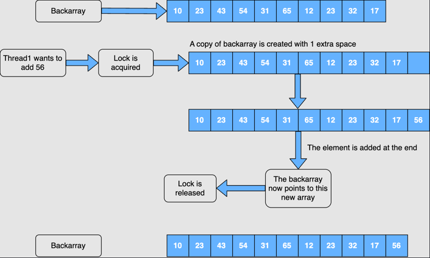

## `CopyOnWriteArrayList` in Java

<details>
<summary>Introduction</summary>

Discussion of thread-safe lists.

Topics:
- Creating a `CopyOnWriteArrayLists`
    - Using the no-arg constructor
    - Using an existing array
    - Using an existing Collection
- Inserting elements into a `CopyOnWriteArrayLists`
    - Using the `add(E e)` method
    - Using the `add(int index, E element)` method
    - Using the `addAll(Collection c)` method
    - Using the `addIfAbsent(E e)` method
    - Using the `addAllAbsent(Collection c)` method


The `ArrayList` and `LinkedList` data structures are not thread-safe.

This means that, while working in an environment where multiple threads are simultaneously adding or removing elements from a list, `ArrayList` and `LinkedList` may not work as intended.
If a thread is iterating over a list and, in the meantime, another thread tries to add an element to the list, then `ConcurrentModificationException` will be thrown.

There are a few options available to use a list in a multithreaded environment. 2 are listed below:
- `Vector`: A legacy class in which all the methods are synchronized.
  Since for each operation, such as add or remove, the entire list is locked, it is slow; hence, it is no longer used.
- `Collections.synchronizedList()`: The problem with this method is that it also locks the entire list for each operation.
  So, there is no performance benefit.

To overcome issues with the 2 options listed above, `CopyOnWriteArrayList` was introduced.
This is a thread-safe list with high performance. In this section, we'll focus on how it is used.

</details>


<details>
<summary>Creating a CopyOnWriteArrayList</summary>

There are three ways to create a `CopyOnWriteArrayList`:

#### Using the no-arg constructor

The default constructor does not take any argument and creates a `CopyOnWriteArrayList` of size zero.
`CopyOnWriteArrayList` has an `Object` array type field named array.

`private transient volatile Object[] array;`

When a list is created using this constructor, the array field is initialized with size zero.

```
public CopyOnWriteArrayList() {
    setArray(new Object[0]);
}

final void setArray(Object[] a) {
    array = a;
}
```

Below is the syntax to create a `CopyOnWriteArrayList` using the default constructor.

`List list = new CopyOnWriteArrayList();`

#### Using an existing array

A `CopyOnWriteArrayList` can also be created using an existing array.
First, a copy of the existing array is made using the `Arrays.copyOf()` method, and then the array variable is initialized with this copied array.

```
public CopyOnWriteArrayList(E[] toCopyIn) {
    setArray(Arrays.copyOf(toCopyIn, toCopyIn.length, Object[].class));
}
```

#### Using an existing `Collection`

A `CopyOnWriteArrayList` can also be created using an existing `Collection`.
An array is created using the elements of the passed `Collection`, and the array variable is initialized with this created array.

</details>


<details>
<summary>Inserting elements into a CopyOnWriteArrayList</summary>

#### Using the `add(E e)` method

The `add(E e)` method inserts an element at the end of the list.
If some other thread is iterating the list while a new element is getting added, then it will not throw `ConcurrentModificationException`.

<br />

#### Using the `add(int index, E element)` method

We can use this method if we want to add an element to a particular index.
The index provided should be greater than zero and less than or equal to the size of the list; otherwise, `IndexOutOfBoundsException` is thrown.
When an element is added at an index, the element currently at that position (if any), and any subsequent elements to the right, are shifted to the right.

<br />

#### Using the `addAll(Collection c)` method

The `addAll(Collection c)` method inserts all the elements present in the provided collection at the end of the list.
The elements are inserted in the same order as returned by the iterator of the passed collection.

<br />

#### Using the `addIfAbsent(E e)` method

The `addIfAbsent()` method adds an element at the end of the list only if the element is not present in the list.

<br />

#### Using the `addAllAbsent(Collection c)` method

This method appends all the specified `Collection` elements that are not already contained in this list, to the end of this list, in the order that the specified `Collection`'s iterator returns them.

</details>


<details>
<summary>CopyOnWriteArrayList: Internal working</summary>

Discussion of how `CopyOnWriteArrayList` provides thread-safety.

<blockquote>
<code>CopyOnWriteArrayList</code> is internally backed by an array.<br />
Throughout these sections, wherever the term <strong>backarray</strong> is used, it means the array in which all the elements added to the <code>CopyOnWriteArrayList</code> are maintained. 
</blockquote>

There is a `ReentrantLock` defined in the `CopyOnWriteArrayList` as shown below:

```
/** The lock protecting all mutators */
final transient ReentrantLock lock = new ReentrantLock();
```

When a new element is added in a `CopyOnWriteArrayList`, the following procedure takes place:

1. The thread that is adding the element acquires a lock on the lock object using the `lock.lock()` method.
   If some other thread tries to add an element to the list, then it will not get access.
2. The thread that has acquired the lock will then make the copy of the backarray.
   So as shown in the below snippet, a new array is created and all the elements from the backarray are added to this new array.
   The size of this new array is one more than the backarray.

   `Object[] newElements = Arrays.copyOf(elements, len + 1);`

3. The element that needs to be added will be added at the end of this newly copied array.

   `newElements[len] = e;`

4. Finally, the backarray will now be pointed to this new array and the lock will be released.
   In this way, a new element is added to the `CopyOnWriteArrayList` in a thread-safe manner.

   

What would happen if one thread is trying to add an element to the list and the other is trying to remove an element from the list?
When a thread tries to read an element from the list, it will refer to the backarray.
Multiple threads can read the data from the list without locking.
It is only when adding an element that a lock is required, and the backarray should be copied.
So, `CopyOnWriteArrayList` is ideal for situations where add operations are minimal, and there are mostly read operations.

It is also important to understand why a copy of the backarray is made when an element is added and why just acquiring the lock is not sufficient as it will stop other threads from adding at the same time.

The reason for copying the `backarray` is to make traversal synchronized.
This is a bit difficult to understand, so it should be explained via example.
But prior to that, let's define one more term to help understand the example.
We already know that `backarray` means the array that contains the elements added to the `CopyOnWriteArrayList`.
The array obtained by copying the `backarray` will be called `copiedarray`.

Let's say we have created a `CopyOnWriteArrayList` that has five elements.
So, the size of the `backarray` is five.

There is a thread, `thread1`, that wants to iterate our list. This thread will create an iterator.
The returned iterator provides a snapshot of the state of the list when the iterator was constructed.

The `thread1` is iterating the array, and in the meantime, another thread, `thread2`, comes to add an element to the list.
If this thread adds the element to the `backarray`, then `ConcurrentModificationException` will be thrown.
To avoid this, `thread2` will create a copy of the `backarray`, and then it will add the new element to this copied array.

The `thread1` will complete its iteration, but it will not be able to see the newly added element.
Now, if a new thread, `thread3`, wants to iterate the list, then it will again create the iterator.
And this time it will get the snapshot of the `backarray`, which has six elements.

<blockquote>
Please note that when <code>CopyOnWriteArrayList</code> creates an iterator, the "snapshot" is a reference to its current array, not a copy of the array.
</blockquote>

</details>


<details>
<summary>CopyOnWriteArrayList: Iteration</summary>


</details>
