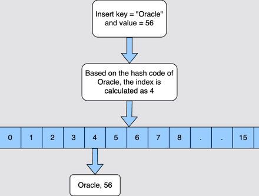
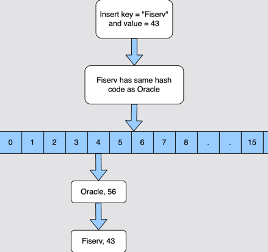
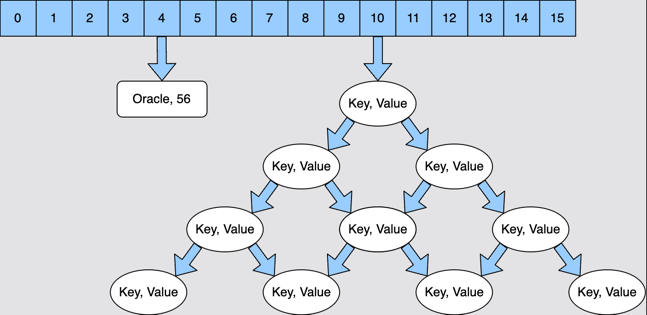
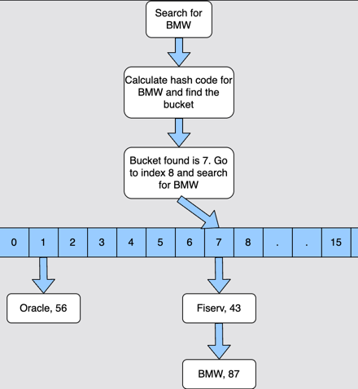

# HashMap: Internal Implementation

How `HashMap` works internally.

Topics:
- Creating a `HashMap`
- Inserting into a `HashMap`
- Fetching a value from `HashMap`
- Resizing a `HashMap`

How `HashMap` works internally is the most asked interview question in Java interviews.
And the reason is that it is difficult to understand the inner workings of `HashMap`.
In this section, we will try to understand every aspect of `HashMap`.

The basic principle used by a `HashMap` to store elements is **Hashing**.
Hashing is a way to assign a unique code for any variable or object after applying any formula to its properties.
The unique code is called a **HashCode**.

Some of the properties of **HashCode** are:

1. If two objects are equal, then they should have the same hashcode.
2. If two objects have the same hashcode, then it is not necessary for them to be equal.

## Creating a `HashMap`

We already know that the **HashMap** stores key-value pairs.
**HashMap** has a nested static class called **Node** as shown below.

```
static class Node<K, V> implements Map.Entry<K, V> {
    final int hash;
    final K key;
    V value;
    Node<K, V> next;
    // ... some more code
}
```

This class has a **key** and a **value** field.
It also has a **next** field that is used to point to the next **Node**.

**HashMap** also has a field called `table` as shown below.
It is basically an array of `Node` objects that are not yet initialized.

```
transient Node<K, V>[] table;
```

When we create a `HashMap` using the no-arg constructor, then the only thing that happens is that the `loadFactor` is assigned `DEFAULT_LOAD_FACTOR`, which is `.75`.

The table array discussed above is not initialized at the time of the creation of `HashMap`.

```
public HashMap() {
    this.loadFactor = DEFAULT_LOAD_FACTOR; // All other fields defaulted
}
```

### Inserting into a `HashMap`

When an element is inserted into the `HashMap` for the first time, the array `table` is initialized with size `16`.
So now there are `16` buckets from index `0` to `15`.

If the **key** that we are inserting is `null`, then it is inserted at index `0` because the hashcode of `null` is `0`.
If the **key** is not `null`, then the hash of the **key** is calculated, and based on the hash value the bucket is decided.

If there is no other element in that bucket, then a new `Node` is created, and it is inserted in that bucket.



Now let's say we insert another key that has the same hashcode as the previous key.
In this case, this key will go to the same bucket and see that there is already an element there.
This is referred to as **collision**.

In case of collision, it checks if the existing key in the bucket is equal to the key that we are trying to store.
If yes, then the value of the key is updated.
If the key is different, then it is added at the end of the existing key in the bucket to form a `LinkedList`.



There is one improvement made in Java 8.
If the size of the `LinkedList` in a particular bucket becomes more than `TREEIFY_THRESHOLD`, then the `LinkedList` is converted to a red-black tree.
`TREEIFY_THRESHOLD` is a constant with a default value of 8.
This value can't be changed as it is a final variable.
This means that if the size of the `LinkedList` becomes more than 8, then it is converted into a tree.



## Fetching a value from `HashMap`

When we need to get a value from `HashMap`, then the hashcode of the key is calculated.
Based on the hashcode the index is decided, and we go to that index.
Now it is possible that there are zero or more keys stored at that index.
We match our key with all the keys at that index using the `equals()` method.
If the match is found, then we return the value of that key. If the key is not found, then `null` is returned.



## Resizing a `HashMap`

We already know that a `HashMap` is resized when it is about to get full.
When a `HashMap` will be resized depends upon the **load factor**.
If the current _capacity_ is 16, and the _load factor_ is 0.75, then the `HashMap` will be resized when it has 12 elements (16 * 0.75).
When a `HashMap` is resized, its capacity is always doubled. So if the current capacity is 16, then the new capacity will be 32.
Now all the elements that are stored in the `HashMap` will be rearranged amongst these 32 buckets.
This is a time-consuming operation as the bucket for each key is calculated and rearranged.
