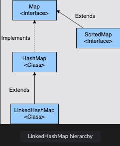
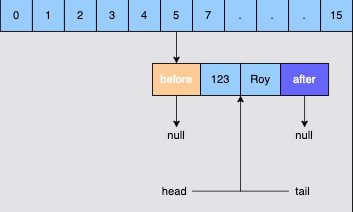
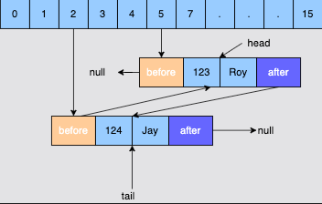
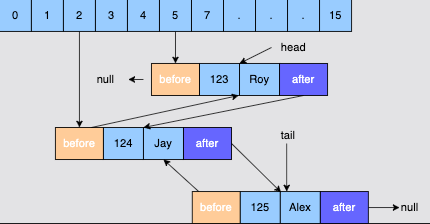

# LinkedHashMap in Java

## LinkedHashMap: Introduction

**Topics**:

- Creating a `LinkedHashMap`
  - Using a no-arg constructor
  - Using the constructor that takes initial capacity
  - Using the constructor that takes initial capacity and load factor
  - Using the constructor that takes access order flag
  - Using the constructor that takes another `Map`
- Inserting into a `LinkedHashMap`

A `HashMap` does not maintain insertion order and `TreeMap` stores the elements in sorted order.
If we want to store the elements in a Map in insertion order, then a `LinkedHashMap` can be used.
`LinkedHashMap` is a class in the `java.util` package that implements the `Map` interface and extends the `HashMap` class.
It is similar to `HashMap` with the additional feature of maintaining the order of elements inserted into it.

Some of the important features of a `LinkedHashMap` are:

1. It does not allow duplicate keys.
2. It may have one `null` key and multiple `null` values.
3. It is non-synchronized.



---

## Creating a `LinkedHashMap`

There are five different constructors available to create a `LinkedHashMap` object.
We'll discuss each of them here:

<details>
<summary>Using the no-arg constructor</summary>

### Using a no-arg constructor

The no-arg constructor, `LinkedHashMap()`, creates a `Map` with a default capacity of **16** and a default load factor of **0.75**.
The elements are stored in the insertion order.

</details>

<details>
<summary>Using the constructor that takes initial capacity</summary>

### Using the constructor that takes initial capacity

The `LinkedHashMap(int capacity)` constructor is used if we need to provide the initial capacity of the `Map`.
This constructor is used if we are already aware of the number of elements that the `Map` will store.
The initial capacity should be greater than zero; otherwise, `IllegalArgumentException` will be thrown.

</details>

<details>
<summary>Using the constructor that takes initial capacity and load factor</summary>

### Using the constructor that takes initial capacity and load factor

The `LinkedHashMap(int capacity, float loadFactor)` constructor is used if we need to provide both the initial capacity and the load factor of the `Map`.
Both the initial capacity and load factor should be greater than zero.
The load factor should be less than one.

</details>

<details>
<summary>Using the constructor that takes access order flag</summary>

### Using the constructor that takes access order flag

The `LinkedHashMap(int capacity, float loadFactor, boolean accessOrder)` accepts three arguments: the initial capacity, the load factor, and the `accessOrder` flag.
If the `accessOrder` is `false`, the elements will be stored in the order of insertion.
If it is `true`, then the elements are stored in order of access.
It means that the element that is accessed most recently is kept last.

</details>

<details>
<summary>Using the constructor that takes another Map</summary>

### Using the constructor that takes another `Map`

This constructor creates an insertion-ordered `LinkedHashMap` instance with the same mappings as the specified `Map`.
The `LinkedHashMap` instance is created with a default load factor (**0.75**) and an initial capacity sufficient to hold the mappings in the specified `Map`.

</details>

---

## Inserting into a `LinkedHashMap`

The `LinkedHashMap` class does not have a `put()` method, but since it extends the `HashMap` class, the `put()` method from the `HashMap` class is used.
In the below example, we have created a `LinkedHashMap` in which a few elements are inserted.
On printing the elements, we can see that the elements were inserted as per the insertion order.

```java
import java.util.LinkedHashMap;
import java.util.HashMap;

public class LinkedHashMap {
    public static void main(String[] args) {
        HashMap<String, Integer> stocks = new LinkedHashMap<>();
        stocks.put("Apple", 123);
        stocks.put("BMW", 54);
        stocks.put("Google", 87);
        stocks.put("Microsoft", 232);
        stocks.put("Oracle", 76);
        System.out.println(stocks);
    }
}
```

In the below example, we have created a `LinkedHashMap` with the access order flag as `true`.
Now the elements that were accessed most recently will be kept at the last position.

```java
import java.util.LinkedHashMap;
import java.util.HashMap;

public class LinkedHashMapDemo {
    public static void main(String[] args) {
        HashMap<String, Integer> stocks = new LinkedHashMap<>(16, 0.75f, true);
        stocks.put("Apple", 123);
        stocks.put("BMW", 54);
        stocks.put("Google", 87);
        stocks.put("Microsoft", 232);
        stocks.put("Oracle", 76);
        
        System.out.println(stocks);
        stocks.get("Google");
        stocks.get("BMW");

        System.out.println(stocks);
    }
}
```

---

## LinkedHashMap: Internal Working

**Topics**:

- Inserting the first element
- Inserting the second element
- Inserting the third element

The internal workings of a `LinkedHashMap` are similar to the internal workings of `HashMap` with one major difference.
In `LinkedHashMap`, each `Entry` maintains the record of the `Entry` that was inserted before it and after it.

If we look at the `Entry` class of `LinkedHashMap`, then we can see that it has two extra fields in comparison to the `Entry` class of `HashMap`.
These extra fields are _before_ and _after_.
For a given `Entry`, the before field points to the `Entry` that was inserted prior to this `Entry`.
The _after_ field points to the `Entry` that was inserted after this `Entry`.

```java
static class Entry<K, V> extends HashMap.Node<K, V> {
    Entry<K, V> before, after;
    Entry(int hash, K key, V value, Node<K, V> next) {
        super(hash, key, value, next);
    }
}
```

There are two additional fields in the `LinkedHashMap`, namely `head` and `tail`.
The `head` points to the first node that was inserted in the `Map` and `tail` points to the last node that was inserted in the `Map`.

Let's take a step-by-step look at how elements are inserted in the `Map`.

<details>
<summary>Inserting the first element</summary>

## Inserting the first element

Let's consider creating a `LinkedHashMap` that stores student information.
The key is the ID of the student and the value is the name of the student.

We are inserting our first record:

123; "Roy"

in `LinkedHashMap` on the `tail`.
The following process will occur:

1. The hash of **123** will be calculated and a bucket will be decided based on the hash value. Let's say the bucket is **5**.
2. An `Entry` object is created with the key as **123** and the value as **Roy**. The before and after fields are set to `null` as this is the first record.
3. Since there is no element in the `LinkedHashMap`, both the `head` and `tail` variables are `null`. Now both these variables will point towards the newly created `Entry`.

   

</details>

<details>
<summary>Inserting the second element</summary>

## Inserting the second element

Now we will insert the second record:

124; "Jay"

in the `LinkedHashMap` on the `tail`.
The following process will happen:

1. The hash of **124** will be calculated and a bucket will be decided based on the hash value. Let's say the bucket is **2**.
2. An `Entry` object is created with the key as **124** and the value as **Jay**. The _before_ field is set to the previous `Entry`, and the _after_ field is set to `null`.
3. The `tail` will now point to this entry, and the `head` will remain unchanged.

   

</details>

<details>
<summary>Inserting the third element</summary>

## Inserting the third element

Now we will insert the third record:

125; "Alex"

in the `LinkedHashMap` on the `tail`. The following process will happen:

1. The hash of **125** will be calculated and based on the hash value, a bucket will be decided. Let's say the bucket is **2** again.
2. An `Entry` object is created with the key as `125` and the value as `Alex`. The _before_ field is set to the previous `Entry`, and the _after_ field is set to `null`.
3. The `tail` will not point to this entry, and the `head` will remain unchanged.



</details>

Now it should be clear how a `LinkedHashMap` works.
Basically, a doubly linked list is maintained that keeps track of the insertion order of the elements.
