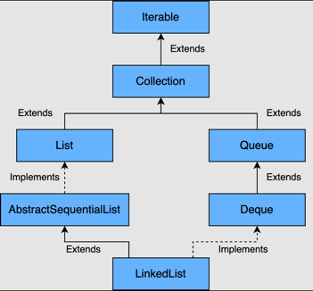
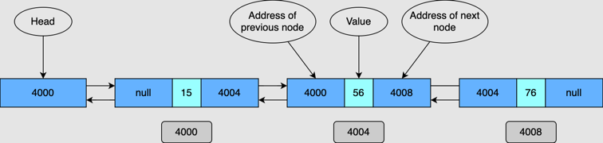

# Linked list

The following topics are covered:

- Internal implementation of `LinkedList`
- Time complexities for `LinkedList` operations
- Adding an element
- Removing an element
- Searching an element
  - Creating a `LinkedList`
- Using the no-arg constructor
- Using existing Collection
  - Inserting an element into a `LinkedList`
- Inserting a single element at the end
- Inserting a single element at the beginning
- Inserting an element at a particular index
- Inserting multiple elements from another Collection
- Inserting multiple elements from another Collection at a particular index

The `LinkedList` class in Java implements the `List` and the `Deque` interface.
A few of the main features of a `LinkedList` are:

1. The elements are inserted in the order of insertion.
2. It supports duplicate elements.
3. Any number of `null` elements can be added.



<details>
<summary>Internal implementation of LinkedList</summary>

## Internal implementation of `LinkedList`

The `LinkedList` class has a static inner class called `Node`.
This class contains three fields:

- `item`: This contains the value of the current element.
- `next`: This contains the pointer to the next element.
- `prev`: This contains the pointer to the previous element.

Below is the code for the `Node` class:

```java
private static class Node<E> {
    E item;
    Node<E> next;
    Node<E> prev;
    
    Node(Node<E> prev, E element, Node<E> next) {
        this.item = element;
        this.next = next;
        this.prev = prev;
    }
}
```

When an element is added to the `LinkedList`, a new `Node` instance is created.
Depending on where the new node is being added, the `prev` and `next` fields are set.

When a node at index `i` is removed, the `next` field of the node at index `i - 1` is set to the node at `index + 1`.
Similarly, the `prev` field of the node at index `i + 1` is set to node `i - 1`.



</details>


<details>
<summary>Time complexities for linked list operations</summary>

## Time complexities for `LinkedList` operations

Let's see what the time complexities are for different operations in a `LinkedList`.

### Adding an element

**O(1)**. If we need to search for the position where the `Node` needs to be inserted, the time complexity is **O(n)**, but the element is usually inserted at the beginning or end, which makes it **O(1)**.

The biggest benefit of `LinkedList`, in comparison to an array, is that when new elements are added, the other elements are not re-arranged.

### Removing an element

Removing an element is also an O(1) operation if we are aware of the position of the element that needs to be removed.
If we need to search and remove an element, it is a **O(1)** operation.

### Searching an element

Search an element is a O(n) operation, as the entire `LinkedList` is iterated to search the element in the worst case.

### Creating a `LinkedList`

There are two ways to create a `LinkedList`:

#### Using the no-arg constructor

Creates a linked list of size zero.

```
List<Integer> list = new LinkedList<>();
```

#### Using existing Collection

A linked list can also be created using an existing Collection.
The newly-created `LinkedList` will contain all the elements in the same order as the original Collection.

```
List<Integer> list = new LinkedList<>(existingList);
```

### Inserting an element into a `LinkedList`

#### Inserting a single element at the end

```
LinkedList<Integer> list = new LinkedList<>();
list.add(3);
list.add(1);
list.addLast(5);
```

#### Inserting a single element at the beginning

```
LinkedList<Integer> list = new LinkedList<>();
list.add(3);
list.add(1);
list.addFirst(0);
```

#### Inserting an element at a particular index

```
LinkedList<Integer> list = new LinkedList<>();
list.add(int index, E element)
```

The index should be greater than zero and less than the size of the LinkedList; otherwise, `IndexOutOfBoundsException` is thrown.

#### Inserting multiple elements from another Collection

```
LinkedList<Integer> list = new LinkedList<>();
list.addAll(existingCollection);
```

#### Inserting multiple elements from another Collection at a particular index

```
addAll(int index, Collection c)
```

e.g.,

```
LinkedList<Integer> list = new LinkedList<>();
list.addAll(index, existingCollection);
```

</details>
