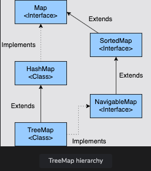

# TreeMap in Java

Discussion of TreeMap in Java.

<details>
<summary>TreeMap: Creation and Insertion</summary>

## TreeMap: Creation and Insertion

Topics:

- Creating a `TreeMap`
    - Using a no-arg constructor
    - Using the constructor with `Comparator` as an argument
    - Using constructor with argument of type `Map`
    - Using constructor with argument of type `SortedMap`
- Inserting elements in a `TreeMap`
    - Using the `put()` method
    - Using the `putAll()` method

`TreeMap` is a class in the `java.util` package that stores the keys in sorted order.
Some of the features of `TreeMap` are:

1. The entries in `TreeMap` are sorted in the natural ordering of its keys.
2. It does not allow `null` keys, however there can be `null` values.
3. The `TreeMap` is not thread-safe, although it can be made thread-safe using the `synchronizeMap()` method of the `Collections` class.

Since a `TreeMap` stores the keys in sorted order, the objects that we are storing in the `TreeMap` should either implement the `Comparable` interface or we should pass a `Comparator` while creating the `TreeMap` object.



### Creating a TreeMap

There are four different ways to create a `TreeMap` object.

#### Using a no-arg constructor

A `TreeMap` can be created easily using the no-arg constructor.
The keys that we will store in this `TreeMap` must implement the `Comparable` interface.

#### Using the constructor with `Comparator` as an argument

If the objects that we are storing in a `TreeMap` as a key do not implement the `Comparable` interface or if we need to store the keys in descending order, then we can provide a custom `Comparator` while creating the `TreeMap`.
Now, when the keys are stored in the `TreeMap`, they are sorted as per the logic provided by the `Comparator`.

#### Using constructor with the argument of type `Map`

A `TreeMap` can be created from another `Map` as well.
The keys are stored in ascending order irrespective of the order that the elements are stored in the provided `Map`.

#### Using constructor with the argument of type `SortedMap`

This constructor behaves as a copy constructor and creates a `TreeMap` with the same elements and ordering of the provided sorted map.

```java
import java.util.Comparator;
import java.util.HashMap;
import java.util.Map;
import java.util.TreeMap;

public class TreeMapDemo {
    public static void main(String[] args) {
        // Creating a TreeMap which will store all the elements in reverse order.
        TreeMap<String, Integer> reverseMap = new TreeMap<>(Comparator.reverseOrder());
        reverseMap.put("Oracle", 43);
        reverseMap.put("Microsoft", 56);
        reverseMap.put("Apple", 43);
        reverseMap.put("Novartis", 87);
        System.out.println("Elements are stored in reverse order: " + reverseMap);
        
        // Creating a HashMap which will store all the elements in random order.
        Map<String, Integer> hashMap = new HashMap<>();
        hashMap.put("Oracle", 43);
        reverseMap.put("Microsoft", 56);
        reverseMap.put("Apple", 43);
        reverseMap.put("Novartis", 87);
        System.out.println("Elements are stored in random order: " + hashMap);
        
        // Creating a TreeMap using existing HashMap. This will store the elements in ascending order.
        TreeMap<String, Integer> treeMap1 = new TreeMap<>(hashMap);
        System.out.println("Elements are stored in ascending order:" + treeMap1);
        
        // Creating a TreeMap using existing TreeMap. This will store the elements in the same order as it was in the passed Map.
        TreeMap<String, Integer> treeMap2 = new TreeMap<>(reverseMap);
        System.out.println("Elements are stored in descending order: " + treeMap2);
    }
}
```

### Inserting elements in a TreeMap

Let's discuss all the methods that we can use to insert the key-value pairs in a `TreeMap`.

#### Using the `put()` method

We can use the `put(K key, V value)` method to insert a key-value pair in a `TreeMap`.
If the key is not present, then a new key-value pair will be added.
If the key is already present, then the value will be updated.

#### Using the `putAll()` method

The `putAll(Map<? extends K, ? extends V> m)` method copies all the mappings from the specified map to this map.
These mappings will replace any mappings that this map had for any of the keys currently in the specified map.

```java
import java.util.TreeMap;

public class TreeMapDemo {
    public static void main(String[] args) {
        TreeMap<String, Integer> map = new TreeMap<>();
        
        map.put("Oracle", 43);
        map.put("Microsoft", 56);
        map.put("Apple", 43);
        map.put("Novartis", 87);

        System.out.println(map);
        
        TreeMap<String, Integer> finalMap = new TreeMap<>();
        
        map.put("Google", 65);
        map.put("Audi", 32);
        finalMap.putAll(map);

        System.out.println(finalMap);
    }
}
```

</details>

<details>
<summary>TreeMap: Fetching and Removal</summary>

## TreeMap: Fetching and Removal

How to fetch and remove elements from a `TreeMap`.

**Topics**:

- Fetching an element from a `TreeMap`
    - Fetching the value for a particular key
    - Fetching the smallest key
    - Fetching the largest key
- Removing an element from a `TreeMap`
- Updating values in a `TreeMap`
    - Replacing without checking the previous value
    - Replacing after checking the previous value

### Fetching an element from a `TreeMap`

The following methods can be used to fetch elements from a `TreeMap`.

#### Fetching the value for a particular key

We can fetch the value for a particular key using the `get(Object o)` method.
This method will return the value of the key if the key is present.
If the key is not present, it will return `null`.

#### Fetching the smallest key

As we are aware that a `TreeMap` stores elements in sorted order, we can fetch the smallest key using the `firstKey()` method.
If the `TreeMap` is empty, then `NoSuchMethodException` is thrown.
If we want to get the smallest entry, then the `firstEntry()` method can be used.

#### Fetching the largest key

We can fetch the largest key using the `lastKey()` method.
If the TreeMap is empty, then `NoSuchElementException` is thrown.
If we want to get the largest entry, then the `lastEntry()` method can be used.

```java
import java.util.Map.Entry;
import java.util.TreeMap;

public class TreeMapDemo {
    public static void main(String[] args) {
        TreeMap<String, Integer> map = new TreeMap<>();
        map.put("Oracle", 43);
        map.put("Microsoft", 56);
        map.put("Apple", 43);
        map.put("Novartis", 87);
        
        // Fetching the first entry in the Map.
        Entry<String, Integer> firstEntry = map.firstEntry();

        System.out.println("Smallest key: " + firstEntry.getKey() + ", Value: " + firstEntry.getValue());
        
        // Fetching the last entry in the Map.
        Entry<String, Integer> lastEntry = map.lastEntry();
        System.out.println("Largest key: " + lastEntry.getKey() + ", Value: " + lastEntry.getValue());
    }
}
```

#### Removing an element from a `TreeMap`

To remove an element from TreeMap, the `remove(Object o)` method can be used.
This method returns the previous value for this key if the key is present.
If the key is not present, the `null` is returned.

```java
import java.util.TreeMap;

public class TreeMapDemo {
    public static void main(String[] args) {
        TreeMap<String, Integer> map = new TreeMap<>();

        map.put("Oracle", 43);
        map.put("Microsoft", 56);
        map.put("Apple", 43);
        map.put("Novartis", 87);

        System.out.println("Removing Oracle from Map. This will return the value corresponding to Oracle: " + map.remove("Oracle"));
        System.out.println("Removing Google from Map. This will return null as Google is not present in the Map: " + map.remove("Google"));
    }
}
```

#### Updating values in a `TreeMap`

If we put a key-value pair in a `TreeMap`, and it is already present, then the value is updated.
But what if we want to update the value of a key only if it is already present in the `Map`?
In that case, we can use the `replace()` method provided in the `TreeMap` class.

It has the following two variations:

**Replacing without checking the previous value**

The `replace(K key, V value)` method is used to replace the value of the given key.
If the key is present then this method replaces the old value with the new value and returns the old value.
If the key is not present then `null` is returned.

**Replacing after checking the previous value**

The `replace(K key, V oldValue, V newValue)` method is used to replace the value of the given key if its current value is the same as the provided value.
If the value is replaced, the `true` is returned. If not, then `false` is returned.

```java
import java.util.TreeMap;

public class TreeMapDemo {
    public static void main(String[] args) {
        TreeMap<String, Integer> map = new TreeMap<>();
        map.put("Oracle", 43);
        map.put("Microsoft", 56);
        map.put("Apple", 43);
        map.put("Novartis", 87);

        System.out.println("Replacing the value of Oracle : " + map.replace("Oracle", 67));
        System.out.println("Latest value of Oracle : " + map.get("Oracle"));

        System.out.println("Replacing the value of Apple only if current value is 50 : " + map.replace("Apple", 50, 90));
        System.out.println("Latest value of Oracle : " + map.get("Apple"));

        System.out.println("Replacing the value of Apple only if current value is 76 : " + map.replace("Apple", 76, 90));
        System.out.println("Latest value of Oracle : " + map.get("Apple"));
    }
}
```

</details>

<details>
<summary>TreeMap: Sorting a TreeMap by Values</summary>

## TreeMap: Sorting a `TreeMap` by Values

How to sort `TreeMap` elements on the basis of values.

We have a `TreeMap` in which we need to store the stock data.
They key is the company's name, and the value is the price of the stock of that company.

By default, when we store the `Map`'s stock data, it will be stored in sorted order by key.
But we need to store the data such that it is sorted by value.
This means that the first element will be the company with the lowest stock price, and the last element will be the company with the highest stock price.

We know that while creating a `TreeMap` object we can provide a `Comparator` implementation that will be used to sort the elements.
We can write a `Comparator` implementation so that it sorts the elements based on values instead of keys.

The below example shows how we can sort the elements on the basis of values.
We have created a `Comparator` implementation that compares the values for the two keys passed to it.

> Please note that in the below implementation, we are returning **1** if both the values are the same.
> The reason for doing this is that if two values are the same, then the `TreeMap` will consider it as duplicate, and it will not insert the keys in the `Map`.

```java
import java.util.Comparator;
import java.util.TreeMap;

public class TreeMapDemo {
    public static TreeMap<String, Integer> sortByValues(TreeMap<String, Integer> map) {
        Comparator<String> valueComparator = new Comparator<String>() {
            // Return comparison results of values of two keys
            public int compare(String k1, String k2) {
                int comp = map.get(k1).compareTo(map.get(k2));
                if (comp == 0) { return 1; }  // Return 1 since by default TreeMap considers equal values as duplicate entries
                else { return comp; }
            }
        };
        
        TreeMap<String, Integer> mapSortedByValues = new TreeMap<>(valueComparator);
        
        mapSortedByValues.putAll(map);
        return mapSortedByValues;
    }
}
```

The above logic can be a bit simplified if we use lambda expressions while creating `Comparator` as shown below:

```java
import java.util.Comparator;
import java.util.TreeMap;

public class TreeMapDemo {
    public static TreeMap<String, Integer> sortByValues(TreeMap<String, Integer> map) {
        Comparator<String> valueComparator = (k1, k2) -> {
            int comp = map.get(k1).compareTo(map.get(k2));
            if (comp == 0) { return 1; }
            else { return comp; }
        };
        
        TreeMap<String, Integer> mapSortedByValues = new TreeMap<>(valueComparator);
        
        mapSortedByValues.putAll(map);
        return mapSortedByValues;
    }
    
    public static void main(String[] args) {
        TreeMap<String, Integer> map = new TreeMap<>();
        map.put("Oracle", 43);
        map.put("Microsoft", 56);
        map.put("Apple", 76);
        map.put("Novartis", 87);
        map.put("Google", 23);
        map.put("Audi", 101);

        System.out.println(sortByValues(map));
    }
}
```

</details>

<details>
<summary>TreeMap: HashMap Sorting</summary>

## TreeMap: `HashMap` Sorting

How to sort a `HashMap` by key and value.

**Topics**:

- Using a `TreeMap`
- Using an `ArrayList`
- Using lambdas and streams

How to sort a `HashMap` by key and value is one of the most important Java interview questions employers ask, and there is no single answer to it.
This topics requires some knowledge of `TreeMap`, which we will discuss in this section.

### Using a TreeMap

Elements are stored in a `TreeMap` in sorted order by default.
We can create a `TreeMap` and then add all the elements from our `HashMap` to the `TreeMap` using the `putAll()` method.

```java
import java.util.HashMap;
import java.util.Map;
import java.util.TreeMap;

public class HashMapDemo {
    public static void main(String[] args) {
        Map<Integer, String> employeeMap = new HashMap<>();
        employeeMap.put(123, "Alex");
        employeeMap.put(342, "Ryan");
        employeeMap.put(143, "Joe");
        employeeMap.put(234, "Allen");
        employeeMap.put(432, "Roy");

        System.out.println("Unsorted map " + employeeMap);
        
        TreeMap<Integer, String> sortedMap = new TreeMap<>();
        sortedMap.putAll(employeeMap);
        System.out.println("Sorted map " + sortedMap);
    }
}
```

### Using an `ArrayList`

We can store all the keys in an `ArrayList`, and then use the `sort()` method of the `Collections` class to sort the list.
If we want to sort the values, then we can store the values in `ArrayList` and sort them.

```java
public class HashMapDemo {
    public static void main(String[] args) {
        Map<Integer, String> employeeMap = new HashMap<>();
        employeeMap.put(123, "Alex");
        employeeMap.put(342, "Ryan");
        employeeMap.put(143, "Joe");
        employeeMap.put(234, "Allen");
        employeeMap.put(432, "Roy");
        
        List<Integer> keyList = new ArrayList<>(employeeMap.keySet());
        Collections.sort(keyList);
        System.out.println(keyList);
        
        List<String> valuesList = new ArrayList<>(employeeMap.values());
        Collections.sort(valuesList);
        System.out.println(valuesList);
    }
}
```

---

### Using lambdas and streams

Java 8 introduced some methods to easily sort a `HashMap` by key or value.
The `comparingByKey` comparator is used to sort the elements by key.
The `comparingByValue` comparator is used to sort the elements by value.

The below example shows how we can sort a `HashMap` by key or value.

```java
import java.util.ArrayList;
import java.util.Collections;
import java.util.HashMap;
import java.util.List;
import java.util.Map;

public class HashMapDemo {
    public static void main(String[] args) {
        Map<Integer, String> employeeMap = new HashMap<>();
        employeeMap.put(123, "Alex");
        employeeMap.put(342, "Ryan");
        employeeMap.put(143, "Joe");
        employeeMap.put(234, "Allen");
        employeeMap.put(432, "Roy");

        System.out.println("Sorting by key");
        employeeMap.entrySet().stream()
            .sorted(Map.Entry.<Integer, String>comparingByKey())
            .forEach(System.out::println);

        System.out.println("Sorting by value");
        employeeMap.entrySet().stream()
            .sorted(Map.Entry.comparingByValue())
            .forEach(System.out::println);
    }
}
```

</details>
