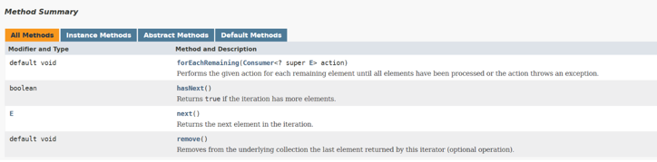

<details>
<summary>forEachRemaining() in Iterator</summary>

Explains the `forEachRemaining()` method, which was introduced in the iterator class in Java 8.

`Iterator` is an interface available in the `Collections` framework in `java.util package`. It is used to iterate a collection of objects. This interface has four methods, as shown in the below image. Before Java 8, the `forEachRemaining()` method did not exist.



Below is a simple program to iterate a list using iterator before Java 8.

```java
import java.util.ArrayList;
import java.util.Iterator;
import java.util.List;

public class IteratorDemo {
    public static void main(String[] args) {
        List<String> fruits = new ArrayList<>();
        fruits.add("Apple");
        fruits.add("Banana");
        fruits.add("Grapes");
        fruits.add("Orange");
        
        Iterator<String> iterator = fruits.iterator();

        while (iterator.hasNext()) {
            System.out.println(iterator.next());
        }
    }
}
```

#### Output

```
Apple
Banana
Grapes
Orange
```

The above example requires a `while` loop in order to iterate through the input list via an `Iterator`. To avoid this, the `forEachRemaining()` method was introduced in Java 8. This method takes in a `Consumer` instance as a parameter.

The `Consumer` interface section mentioned that the `Consumer` interface takes in a parameter and does not return anything. This is what we require for our iterator. Below is the same example shown above, but this time we are using the `forEachRemaining()` method.

```java
import java.util.ArrayList;
import java.util.Iterator;
import java.util.List;

public class IteratorDemo {
    public static void main(String[] args) {
        List<String> fruits = new ArrayList<>();
        fruits.add("Apple");
        fruits.add("Banana");
        fruits.add("Grapes");
        fruits.add("Orange");

        Iterator<String> iterator = fruits.iterator();

        iterator.forEachRemaining((fruit) -> System.out.println(fruit));
    }
}
```

#### Output

```
Apple
Banana
Grapes
Orange
```

The main purpose of introducing the `forEachRemaining()` method was to make the iteration code more concise and readable.

---

The next section discusses improvements in the `Map` API.

</details>


<details>
<summary>Map API Improvements: Fetch Operations</summary>

Explains the new methods added in the `Map` API for fetch operations.

The following topics are covered:
- `getOrDefault()`
- `putIfAbsent()`
- `compute()`, `computeIfAbsent()`, and `computeIfPresent()`

If you have used `Map` then you must have faced a challenge where you needed to update the value of a key in the `Map`. Now, before updating, you must first check if the value is present in the `Map`, get the current value, update it, and again put the value in the `Map`. This is quite a cumbersome process, and it involves using lots of `if`/`else` statements. This kind of code is difficult to understand and fix if any issues occur.

Thankfully, Java 8 has introduced some new methods in the `Map` interface to make our lives easier. In this lesson, we will discuss some of those new methods.

### 1. `getOrDefault()`

This method is a lifesaver if you need to update a certain key in the `Map`. The `getOrDefault()` method either returns the value of the key, or it returns the default value if the key is not present.

```java
import java.util.HashMap;
import java.util.Map;

public class MapUpgrades {
    public static void main(String[] args) {
        Map<String, Integer> fruits = new HashMap<>();
        fruits.put("apple", 20);
    
        // We need to add 20 bananas in map.
        // Below line will throw NullPointerException if banana is already not present in the map.
        
        // fruits.put("banana", fruits.get("banana") + 20); 
    
        // This is the correct way to update map value before Java 8.
        if (fruits.containsKey("banana")) {
            fruits.put("banana", fruits.get("banana") + 20);
        } else {
            fruits.put("banana", 20);
        }

        System.out.println(fruits);
    }
}
```

#### Output

```
{banana=20, apple=20}
```

Below is the same example using the `getOrDefault()` method. Now we don't need the `if`/`else` checks to update a value in the `Map`.

```java
import java.util.HashMap;
import java.util.Map;

public class MapUpgrades {
    public static void main(String[] args) {
        Map<String, Integer> fruits = new HashMap<>();
        fruits.put("apple", 20);
        fruits.put("banana", fruits.getOrDefault("banana", 0) + 20);
        System.out.println(fruits);
    }
}
```

#### Output

```
{banana=20, apple=20}
```

### 2. `putIfAbsent()`

You might be aware that the `put()` method in `Map` either inserts a key-value pair in the `Map` or updates the value if the key is already present. Now, what if you don't want to update the value in the `Map`. You want to insert a key-value pair only if it is not present in the `Map`.

This can be achieved by the `putIfAbsent()` method. This method inserts a key and value in the `Map` only if it is not present. Let's look at how it works in the example below.

```java
import java.util.HashMap;
import java.util.Map;

public class MapUpgrades {
    public static void main(String[] args){
        Map<String , Integer> fruits = new HashMap<>();
        fruits.put("apple", 20);
        System.out.println(fruits.get("apple"));
        fruits.putIfAbsent("apple", 30);
        System.out.println(fruits.get("apple"));
    }
}
```

#### Output

```
20
20
```

### 3. `compute()`, `computeIfAbsent()`, and `computeIfPresent()`

The `compute()` method computes a new mapping given the key and its existing value. This method returns the computed value. If the key is not present in the map, then an exception is thrown.

```java
import java.util.HashMap;
import java.util.Map;

public class ComputeExample {
    public static void main(String[] args) {
        Map<String, Integer> fruits = new HashMap<>();
        fruits.put("apple", 20);
    
        int val = fruits.compute("apple", (k, v) -> v + 10);
    
        System.out.println(val);
        // Below line will throw Null Pointer Exception.
        // val = fruits.compute("banana", (k, v) -> v + 10);
    }
}
```

### Output

```
30
```

The `computeIfAbsent()` method returns:
- The original value if the key is already present in the map.
- The computed value if the key is not present in the map.

This method takes a key and a Function as a parameters.

```java
import java.util.HashMap;
import java.util.Map;

public class ComputeIfAbsentExample {
    public static void main(String[] args) {
        Map<String, Integer> fruits = new HashMap<>();
        fruits.put("apple", 20);
    
        int val = fruits.computeIfAbsent("apple", v ->  10);
        System.out.println(val);
        
        val = fruits.computeIfAbsent("banana", v ->  10);
        System.out.println(val);
    }
}
```

#### Output

```
20
10
```

The `computeIfPresent()` method returns:
- A `null` value if the key is not present in the map.
- The computed value if the key is present in the map.

This method takes a key and a `BiFunction` as parameters.

```java
import java.util.HashMap;
import java.util.Map;

public class ComputeIfPresentExample {
    public static void main(String[] args) {
        Map<String, Integer> fruits = new HashMap<>();
        fruits.put("apple", 20);
    
        Integer val = fruits.computeIfPresent("apple", (k, v) -> v + 10);
        System.out.println(val);
        
        val = fruits.computeIfPresent("banana", (k, v) -> v + 10);
        System.out.println(val);
    }
}
```

#### Output

```
30
null
```

---

The next section discusses more improvements done to the `Map` interface.

</details>