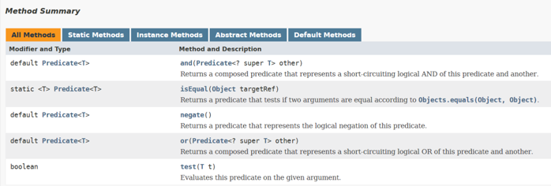
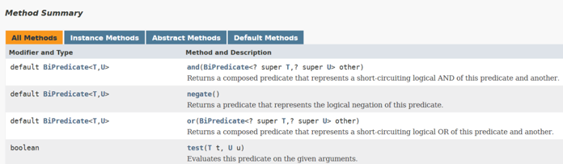

<details>
<summary>Lambda basics</summary>

The following topics are covered:
- Lambda expression definition
- How to write a lambda expression

### What is a lambda expression?

Java is an object-oriented language. By introducing lambdas in Java 8, the authors of Java tried to add elements of functional programming in Java. Now you might be wondering what the difference between object-oriented programming and functional programming is?

In object-oriented programming, objects and classes are the main entities. If we create a function then it should exist within a class. A function has no meaning outside the scope of the class object.

In functional programming, functions can exist outside the scope of an object. We can assign them to a reference variable and we can also pass them to other methods as a parameter.

A lambda expression is just an *anonymous function*, i.e., a function with **no name** and that is **not bound to an identifier**. We can pass it to other methods as parameters, therefore, using the power of functional programming in Java.

### How to write a lambda expression

It might be difficult to understand what lambda is and how to write a lambda without looking at an example. So, let’s look at an example first, and then we will revisit what we just read.

In the below example, we have a functional interface called `AFunctionalInterface`. There are two classes `ClassA` and `ClassB` that implement this interface.

#### AFunctionalInterface

```java
@FunctionalInterface
public interface AFunctionalInterface {
    void execute();
}
```

#### ClassA

```java
public class ClassA implements AFunctionalInterface {
    // Overriding the execute() method from AFunctionalInterface interface.
    @Override
    public void execute() {
        System.out.println("Namaste");
    }
}
```

#### ClassB

```java
public class ClassB implements AFunctionalInterface {
    // Overriding the execute() method from AFunctionalInterface interface.
    @Override
    public void execute() {
        System.out.println("Hi");
    }
}
```

Here, we have another class called `ClassC`. This class has a method called `wish(AFunctionalInterface functionalInterface)` which takes `AFunctionalInterface` as a parameter, and based on the type of object passed, prints the output of the `execute()` method.

#### ClassC

```java
public class ClassC {
    public static void wish(AFunctionalInterface functionalInterface) {
        functionalInterface.execute();
    }

    public static void main(String[] args) {
        AFunctionalInterface functionalInterface_1 = new ClassA();
        wish(functionalInterface_1);  // Passing an object of ClassA.

        AFunctionalInterface functionalInterface_2 = new ClassB();
        wish(functionalInterface_2);  // Passing an object of ClassB.
    }
}
```

When we run the `ClassC` class, we get the below output:

```
Namaste
Hi
```

This is a classic object-oriented programming example. Now, what if we want our `ClassC` class to greet in all the languages available?

Do we need to create a class for each concrete entity, e.g., `ClassD`, `ClassE`, `ClassF`, etc?

Isn't it possible that we don't create any class and just send a function to the `wish(AFunctionalInterface functionalInterface)` method?

Our `wish(AFunctionalInterface functionalInterface)` method will directly execute the function that is provided to it and print the output.

This is possible through anonymous classes. We will quickly see how this can be done through an anonymous class, and then jump straight back into lambdas.

In the below example, we will change the `ClassC` class to use an anonymous class.

#### AFunctionalInterface

```java
@FunctionalInterface
public interface AFunctionalInterface {
    void execute();
}
```

#### ClassC

```java
public class ClassC {

    public static void wish(AFunctionalInterface functionalInterface) {
        functionalInterface.execute();
    }

    public static void main(String[] args) {
        // We are passing an anonymous class object to the wish method.
        wish(new AFunctionalInterface() {
            @Override
            public void execute() {
                System.out.println("Namaste");
            }
        });
    }

}
```

In the above example, we don’t need to create a class for each language. We can use an anonymous class, and that does the trick for us in the example above. However, don’t you think that this code is still cumbersome? Although the class is anonymous, we are still creating a class.

To make our code less cumbersome, let’s remove all the unnecessary code step-by-step and create our first lambda expression.

**Step 1**: The compiler knows that the `wish(AFunctionalInterface functionalInterface)` method takes in a parameter of type `AFunctionalInterface`. So, we don’t need to specifically create an anonymous class of type `AFunctionalInterface`.

```java
public class ClassC {

    public static void wish(AFunctionalInterface functionalInterface) {
        functionalInterface.execute();
    }

    public static void main(String[] args) {
        wish(
            public void execute() {
                System.out.println("Namaste");
            }
        );
    }
}
```

**Step 2**: We know that the `AFunctionalInterface` interface has only one method. So, we don’t need to provide the method name. We are only concerned with the method body.

```java
public class ClassC {

    public static void wish(AFunctionalInterface functionalInterface) {
        functionalInterface.execute();
    }

    public static void main(String[] args) {
        wish(
            public void () {
                System.out.println("Namaste");
            }
        );
    }
}
```

**Step 3**: The compiler can understand that the body does not return anything. So, mentioning the return type is redundant. We can also remove the `public` declaration.

```java
public class ClassC {

    public static void wish(AFunctionalInterface functionalInterface) {
        functionalInterface.execute();
    }

    public static void main(String[] args) {
        wish(
            () -> {
                System.out.println("Namaste");
            }
        );
    }
}
```

Please note that we add a `->` between the empty brackets and the method body. This is how a lambda expression is declared.

There still is one more improvement we can make. Since the method body contains only a single line, the curly braces are also unnecessary.

#### AFunctionalInterface

```java
@FunctionalInterface
public interface AFunctionalInterface {
    void execute();
}
```

#### ClassC

```java
public class ClassC {
    public static void wish(AFunctionalInterface functionalInterface) {
        functionalInterface.execute();
    }

    // Passing a lambda expression to wish method.
    public static void main(String[] args) {
        wish( () -> System.out.println("Namaste") );
    }
}
```

This is how simple it is to write a lambda expression.

To recap, when we write a lambda expression, we are basically sending a function as a method parameter, and it is directly getting executed.

Note that lambda expressions are not compiled to anonymous inner classes. Instead, lambdas get wrapped inside new classes generated during runtime.

</details>


<details>
<summary>Java Comparator using Lambda</summary>

Use lambdas to write a concise comparator.

The following topics are covered:
- Comparator example using anonymous classes
- Comparator example using a lambda expression

If you’ve been working with Java for some time, then you’ve probably encountered a scenario where you need to sort the elements in a collection.

If your collection contains a *wrapper class object*, then the sorting is very easy. Since all the wrapper classes implement the `Comparable` interface, you can directly use `Collections.sort()` to sort your collection.

However, if your collection contains a custom class object then you need to provide the logic to sort your object. In this lesson, we will look at an example in which we will sort a list of `Person` class objects using a **comparator**. Then, we will write a program to do the same task using **lambdas**.

### Comparator example using anonymous classes

First, we will create a `Person` class.

#### Person

```java
public class Person {

    private String name;
    private int age;
    private String country;

    public Person(String name, int age, String country) {
        this.name = name;
        this.age = age;
        this.country = country;
    }

    public String getName() {
        return name;
    }

    public int getAge() {
        return age;
    }

    public String getCountry() {
        return country;
    }
}
```

Now, we have a `PersonService` class. It has a `getPersons(List<Person> persons)` method. It takes a **list of person object** as input and returns a **list of person object** in sorted order.

In this method, we are creating an anonymous comparator, which sorts the `Person` objects on the basis of name.

#### PersonService

```java
import java.util.Collections;
import java.util.Comparator;
import java.util.List;

public class PersonService {

    public static List<Person> getPersons(List<Person> persons){
        // Created an anonymous Comparator, which sorts the Person object on the basis of Person name.
        Collections.sort(persons, new Comparator<Person>() {
            @Override
            public int compare(Person p1, Person p2) {
                return p1.getName().compareTo(p2.getName());
            }
        });
        return persons;
    }
}
```

Finally, we have a `PersonMain` class that runs our logic.

#### PersonMain

```java
import java.util.ArrayList;
import java.util.List;

public class PersonMain {

    public static void main(String[] args){
        List<Person> persons = new ArrayList<>();
        persons.add(new Person("John" , 23 , "USA"));
        persons.add(new Person("Carl" , 23 , "Australia"));
        persons.add(new Person("Amit" , 23 , "India"));
        persons.add(new Person("Vikram" , 23 , "Bhutan"));
        persons.add(new Person("Kane" , 23 , "Brazil"));
        // Calling getPerson() method which will return the List of Person in sorted order.
        List<Person> sortedPersons = PersonService.getPersons(persons);

        System.out.println("Persons after sorting");
        // Printing the name of each person.
        for (Person person : sortedPersons){
            System.out.println("Person Name : " + person.getName());
        }
    }
}
```

If you look at the `Comparator` interface, you notice that it is a functional interface. It has only one abstract method called `compare()`. This makes it a perfect candidate to be used in lambdas.

### Comparator example using a lambda expression

Now, let’s see how we can write the same logic using a lambda expression. When writing lambdas, we only need to consider the input parameters and the method body.

Below is the signature of the `compare()` method.

`int compare(T o1, T o2)`

It takes two parameters as input and returns an `int`.

Let's start constructing the lambda expression:

The structure of lambda will be like:

`(p1, p2) -> {};`

Here, `p1` and `p2` are the two input parameters. We can name them anything.

Now, we will add the body.

`(p1, p2) -> p1.getName().compareTo(p2.getName());`

So, this is the lambda expression for sorting the `Person` objects based on name.

You can see how easy and concise it is to write code with lambdas instead of using anonymous classes.

#### Person

```java
public class Person {

    private String name;
    private int age;
    private String country;

    public Person(String name, int age, String country) {
        this.name = name;
        this.age = age;
        this.country = country;
    }

    public String getName() {
        return name;
    }

    public int getAge() {
        return age;
    }

    public String getCountry() {
        return country;
    }
}
```

#### PersonService

```java
import java.util.Collections;
import java.util.Comparator;
import java.util.List;

public class PersonService {

    public static List<Person> getPersons(List<Person> persons) {
        // Instead of creating an anonymous class, we have provided a lambda expression.
        Collections.sort(persons, (p1, p2) -> p1.getName().compareTo(p2.getName()));
        return persons;
    }
}
```

#### PersonMain

```java
import java.util.ArrayList;
import java.util.List;

public class PersonMain {

    public static void main(String[] args){
        List<Person> persons = new ArrayList<>();
        persons.add(new Person("John" , 23 , "USA"));
        persons.add(new Person("Carl" , 23 , "Australia"));
        persons.add(new Person("Amit" , 23 , "India"));
        persons.add(new Person("Vikram" , 23 , "Bhutan"));
        persons.add(new Person("Kane" , 23 , "Brazil"));
        // Calling getPerson() method which will return the List of Person in sorted order.
        List<Person> sortedPersons = PersonService.getPersons(persons);

        System.out.println("Persons after sorting");
        for(Person person : sortedPersons){
            System.out.println("Person Name : " + person.getName());
        }
    }
}
```

</details>


<details>
<summary>Predicate Functional Interface</summary>

Introduces the `Predicate` functional interface. We will discuss where a `Predicate` interface can be used and how to use it.

The following topics are covered:
- Introduction to the `Predicate` interface
  - a) `and(Predicate other)`
  - b) `or(Predicate other)`
  - c) `negate()`
  - d) `isEqual(Object targetRef)`
- Introduction to the `BiPredicate` interface

### Introduction to the `Predicate` interface

Java 8 provides some in-built functional interfaces in the `java.util.function` package. These interfaces are required so that, while writing lambda expressions, we don't need to worry about creating a functional interface.

There are 43 predefined interfaces in Java 8. Remembering all of them is a bit difficult, so we will divide them into categories and look at each category. The first category that we are looking at in this lesson is `Predicate`.

Below are the interfaces in this category:

| Interface name          | Description                                                                        | Abstract method              |
|-------------------------|------------------------------------------------------------------------------------|------------------------------|
| `Predicate<T>`          | Represents a predicate (boolean-value function) of one argument (reference type)   | `boolean test(T t)`          |
| `DoublePredicate`       | Accepts one double-value argument                                                  | `boolean test(double value)` |
| `IntPredicate`          | Accepts one int-value argument.                                                    | `boolean test(int value)`    |
| `LongPredicate`         | Accepts one long-value argument                                                    | `boolean test(long value)`   |
| `BiPredicate<T, U>`     | Accepts two arguments (reference types)                                            | `boolean test(T t, U u)`     |

The `Predicate<T>` interface has an abstract method `boolean test(T t)`. Basically, a predicate is a function that evaluates the given input and returns `true` or `false`.

Below is the list of methods available in the `Predicate<T>` interface.



As we can see, there is only one abstract method and a few default and static methods.

Let's look at an example. We have a `PredicateDemo` class, which has a method `isPersonEligibleForVoting()`. This method takes in a `Person` object and a `Predicate` as a parameter. The `Predicate` is evaluated to check if the given `Person` is eligible for voting or not.

```java
import java.util.function.Predicate;

public class PredicateDemo {
    static boolean isPersonEligibleForVoting(Person person, Predicate<Person> predicate){
        return predicate.test(person);
    }
  
    public static void main(String[] args) {
        Person person = new Person("Alex", 23);
        // Created a predicate. It returns true if age is greater than 18.
        Predicate<Person> predicate = p -> p.age > 18;
        boolean eligible = isPersonEligibleForVoting(person, predicate);
        System.out.println("Person is eligible for voting: " + eligible);
    }
}

class Person {
    String name;
    int age;
    Person(String name, int age){
        this.name = name;
        this.age = age;
    }
}
```

In the above example, we use a `Predicate<T>`. This interface has some other default and static methods that are used for the purpose of chaining. We will discuss these methods and look at one example for each of them.

### a) `and(Predicate other)`

This method returns a composed predicate that represents a short-circuiting logical AND of this predicate and another.

In the below example, we need to check if a person is eligible for club membership. The criteria is that the person’s age should be more than 18 and less than 60.

We have created two predicates and then combined them into a single predicate using the `and()` method.

```java
import java.util.function.Predicate;

public class PredicateDemo {
    static boolean isPersonEligibleForMembership(Person person, Predicate<Person> predicate){
        return predicate.test(person);
    }

    public static void main(String[] args) {
        Person person = new Person("Alex", 23);

        // Created a predicate. It returns true if age is greater than 18.
        Predicate<Person> greaterThanEighteen = (p) -> p.age > 18;
        // Created a predicate. It returns true if age is less than 60.
        Predicate<Person> lessThanSixty = (p) -> p.age < 60;
        
        Predicate<Person> predicate = greaterThanEighteen.and(lessThanSixty);

        boolean eligible = isPersonEligibleForMembership(person, predicate);
        System.out.println("Person is eligible for membership: " + eligible);
    }
}

class Person {
    String name;
    int age;

    Person(String name, int age) {
        this.name = name;
        this.age = age;
    }
}
```

#### Output

```
Person is eligible for membership: true
```

### b) `or(Predicate other)`

This method returns a composed predicate that represents a short-circuiting logical OR of this predicate and another.

In the below example we need to check if a person is eligible for retirement. The criteria is that either the person’s age should be more than 60 or the year of service should be more than 30.

We will create two predicates and then combined them into a single predicate using the `or()` method.

```java
import java.util.function.Predicate;

public class PredicateDemo {
    static boolean isPersonEligibleForRetirement(Person person, Predicate<Person> predicate){
        return predicate.test(person);
    }
    
    public static void main(String[] args) {
        Person person = new Person("Alex", 23);
        // Created a predicate. It returns true if age is greater than 60.
        Predicate<Person> greaterThanSixty = (p) -> p.age > 60;
        // Created a predicate. It returns true if year of service is greater than 30.
        Predicate<Person> serviceMoreThanThirty = (p) -> p.yearsOfService > 30;
        Predicate<Person> predicate = greaterThanSixty.or(serviceMoreThanThirty);

        boolean eligible = isPersonEligibleForRetirement(person , predicate);
        System.out.println("Person is eligible for membership: " + eligible);
    }
}

class Person {
    String name;
    int age;
    int yearsOfService;

    Person(String name, int age) {
        this.name = name;
        this.age = age;
        this.yearsOfService = yearsOfService;
    }
}
```

#### Output

```
Person is eligible for membership: false
```

### c) `negate()`

This method returns a predicate that represents the logical negation of the predicate it is called on.

Suppose we have a Predicate defined, but in some areas, we need to negate that predicate. In that case, we can use `negate()`.

In the below example, we have a predicate that checks if a number is greater than 10. However, we need to check if a number is less than 10. Now instead of writing a new predicate, we can negate the predicate we already have.

```java
import java.util.function.Predicate;

public class PredicateDemo {
    static boolean isNumberLessThanTen(Predicate<Integer> predicate){
        return predicate.negate().test(14);
    }

    public static void main(String[] args) {
        Predicate<Integer> numberGreaterThanTen = p -> p > 10;
        boolean isLessThanTen = isNumberLessThanTen(numberGreaterThanTen);
        System.out.println("Is number less than ten: " + isLessThanTen);
    }
}
```

#### Output

```
Is number less than ten: false
```

### d) `isEqual(Object targetRef)`

This method returns a predicate that tests if two arguments are equal according to `Objects.equals(Object, Object)`. This is not a chaining method.

```java
import java.util.function.Predicate;

public class PredicateDemo {
    public static void main(String[] args) {
        Predicate<String> predicate  = Predicate.isEqual("Hello");

        // The same thing can be achieved by below lambda.
        // Predicate<String> predicate  = p -> p.equals("Hello");
    
        System.out.println(predicate.test("Welcome"));
    }
}
```

#### Output

```
false
```

### Introduction to the `BiPredicate` interface

The `Predicate<T>` takes only one parameter and returns the result. Now suppose we have a requirement where we need to send two parameters (i.e., `Person` object and min age to vote) and then return the result. Here, we can use `BiPredicate<T, T>`.

The `BiPredicate<T, T>` has a functional method `test(Object, Object)`. It takes in two parameters and returns a `boolean` value. Below is the list of methods in the `BiPredicate<T, T>` interface.



If you notice in the above example, we are hard coding the voting age in our lambda, e.g., `p -> p.getAge() > 18`. The voting age, i.e., 18, is hardcoded here. If we want to take this age as input, we can use a `BiPredicate` instead of `Predicate`.

In the example shown below, `isPersonEligibleForVoting()` takes in three parameters. `Person` object, `age`, and `BiPredicate`.

```java
import java.util.function.BiPredicate;

public class PredicateTest {
    static boolean isPersonEligibleForVoting(Person person, Integer minAge, BiPredicate<Person, Integer> predicate) {
        return predicate.test(person, minAge);
    }

    public static void main(String[] args) {
        Person person = new Person("Alex", 23);
        boolean eligible =
            isPersonEligibleForVoting(
                person,
                18,
                (p, minAge) -> {
                  return p.age > minAge;
                });
        System.out.println("Person is eligible for voting: " + eligible);
    }
}

class Person {
    String name;
    int age;
    Person(String name, int age) {
        this.name = name;
        this.age = age;
    }
}
```

Similarly, we can use other predicates like `IntPredicate`, `LongPredicate`, and `DoublePredicate`. The only difference is that these predicates take an input of a particular type, i.e., `int`, `double`, or `long`.

You should now have a clear understanding of using the `Predicate` functional interface in your lambdas.

</details>