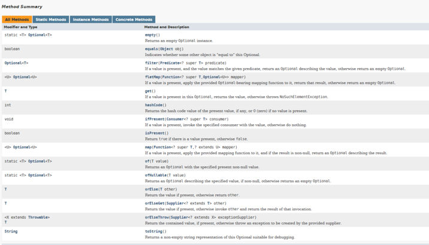

<details>
<summary>Introduction</summary>

Introduces the Stream API.

The following topics are covered:
- Stream creation
  - a) `Stream.of(v1, v2, v3, ...)`
  - b) `List.stream()`
- The Stream interfaces
  - Intermediate operations
  - Terminal operations

The addition of the `Stream` API was one of the major features added to Java 8. A `Stream` in Java can be defined as a sequence of elements from a source that supports aggregate operations on its elements. The source here refers to collections or arrays that provide data to a stream.

A few important points about streams are:
1. A stream is not a data structure itself. It is a bunch of operations applied to a source. The source can be collections, arrays or I/O channels.
2. Streams don’t change the original data structure.
3. There can be zero or more intermediate operations that transform a stream into another stream.
4. Each intermediate operation is lazily executed (This will be discussed later).
5. Terminal operations produce the result of the stream.

### Stream creation

Streams can be created from different element sources, e.g., a collection or an array with the help of `stream()` and `of()` methods. Below are the different ways to create a stream.

### a) `Stream.of(v1, v2, v3, ...)`

In the below example, we are creating a stream of integers using the `Stream.of()` method.

```java
import java.util.stream.Stream;

public class StreamDemo {
    public static void main(String[] args) {
        Stream<Integer> stream = Stream.of(1,2,3,4,5,6,7,8,9);
        stream.forEach(p -> System.out.println(p));
    }
}
```

#### Output

```
1
2
3
4
5
6
7
8
9
```

### b) `List.stream()`

In the below example, we are creating a stream from a `List`.

```java
import java.util.ArrayList;
import java.util.List;
import java.util.stream.Stream;

public class StreamDemo {
    public static void main(String[] args) {
        List<String> list = new ArrayList<>();
        list.add("a");
        list.add("b");
        list.add("c");
        list.add("d");

        Stream<String> stream = list.stream();
        stream.forEach(p -> System.out.println(p));
    }
}
```

#### Output

```
a
b
c
d
```

### The Stream interfaces

The Stream API defines a few interfaces such as `Stream`, `IntStream`, `LongStream`, etc.

The `Stream<T>` interface is for object elements. For primitives, it defines `IntStream`, `LongStream` and `DoubleStream` interfaces.

It is a good practice to use primitive streams if you are dealing with primitives because wrapping primitives to objects and auto-boxing is a costly process.

Below is the complete list of methods defined in Stream API.


The methods defined by these interfaces can be divided into the following two categories:

### Intermediate operations

These methods do not produce any results. They usually accept functional interfaces as parameters and always return a new stream. Some examples of intermediate operations are `filter()`, `map()`, etc.

### Terminal operations

These methods produce some results, e.g., `count()`, `toArray(..)`, and `collect(..)`.

The streams operations can be further classified as:
1. filtering
2. slicing
3. mapping
4. matching and finding
5. reduction
6. collect

This was the basic introduction to streams. In subsequent sections, we will explore each of these operations. We will also look at how these methods are combined to process collections.

---

The next section discusses the filtering operations in `Stream`.

</details>


<details>
<summary>Filtering Operations in Stream</summary>

Discusses filtering operations in `Stream`.

The following topics are covered:
- `filter()` method
- `filter()` with custom object
- `filter()` chaining

The filtering operations filters the given stream and returns a new stream, which contains only those elements that are required for the next operation.

### `filter()` method

The `Stream` interface has a `filter()` method to filter a stream. This is an intermediate operation. Below is the method definition of the `filter()` method.

`Stream filter(Predicate<? super T> predicate)`

**Parameter**: A predicate to apply to each element to determine if it should be included.

**Return Type**: It returns a stream consisting of the elements of this stream that match the given predicate.

```java
import java.util.ArrayList;
import java.util.List;
import java.util.stream.Stream;

public class StreamDemo {
    public static void main(String[] args) {
        //Created a list of integers
        List<Integer> list = new ArrayList<>();
        list.add(1);
        list.add(12);
        list.add(23);
        list.add(45);
        list.add(6);

        list.stream()                           // Created a stream from the list
                .filter(num -> num > 10)        // filter() operation to get only numbers greater than 10
                .forEach(System.out::println);  // Printing each number in the list after filtering.

        // Again, printing the elements of `List` to show that the original list is not modified.
        System.out.println("Original list is not modified");
        list.stream().forEach(System.out::println);
    }
}
```

#### Output

```
12
23
45
Original list is not modified
1
12
23
45
6
```

In the above example, we created a list of integers. We followed the below steps:
1. Create a stream from the list.
2. Apply a `filter()` operation on this stream. We want to print only those numbers which are **greater than 10**, so we add a filter.

Please note that the filter operation *does not modify the original `List`*.

### `filter()` with custom object

Let's look at another example of `filter()` with a custom object.

In the below example, we are using multiple conditions in the filter method.

```java
import java.util.ArrayList;
import java.util.List;

public class StreamDemo {
    public static void main(String[] args) {
        List<Person> list = new ArrayList<>();  // Create a list of Person object.
        list.add(new Person("Dave", 23));
        list.add(new Person("Joe", 18));
        list.add(new Person("Ryan", 54));
        list.add(new Person("Iyan", 5));
        list.add(new Person("Ray", 63));

        // We are filtering out those persons whose age is more than 18 and less than 60.
        list.stream()
                .filter(person -> person.getAge() > 18 && person.getAge() < 60)
                .forEach(System.out::println);
    }
}

class Person {
    String name;
    int age;

    Person(String name, int age) {
        this.name = name;
        this.age = age;
    }

    public String getName() { return name; }

    public int getAge() { return age; }

    @Override
    public String toString() {
        return "Person{" +
                "name='" + name + '\'' +
                ", age=" + age +
                '}';
    }
}
```

#### Output

```
Person{name='Dave', age=23}
Person{name='Ryan', age=54}
```

In the above example, multiple conditions were used inside the filter.

### `filter()` chaining

In the above example, we wrote all the conditions in a single filter.

We can also chain the filter method to make the code more readable.

```java
import java.util.ArrayList;
import java.util.List;

public class StreamDemo {
    public static void main(String[] args) {
        List<Person> list = new ArrayList<>();
        list.add(new Person("Dave", 23));
        list.add(new Person("Joe", 18));
        list.add(new Person("Ryan", 54));
        list.add(new Person("Iyan", 5));
        list.add(new Person("Ray", 63));

        list.stream()
                .filter(person -> person.getName() != null ) // Filtering the object where name is not null
                .filter(person -> person.getAge() > 18 ) // Filtering the objects where age is greater than 18
                .filter(person -> person.getAge() < 60) // Filtering the objects where age is less than 60
                .forEach(System.out::println);
    }
}

class Person {
    String name;
    int age;

    Person(String name, int age) {
        this.name = name;
        this.age = age;
    }

    public String getName() { return name; }
    public int getAge() { return age; }

    @Override
    public String toString() {
        return "Person{" +
                "name='" + name + '\'' +
                ", age=" + age +
                '}';
    }
}
```

#### Output

```
Person{name='Dave', age=23}
Person{name='Ryan', age=54}
```

---

The next section discusses the mapping operations in `Stream`.

</details>


<details>
<summary>Mapping Operations in Stream</summary>

Discusses mapping operations and the different ways to transform a stream.

The following topics are covered:
- Understanding `map()`
- Understanding `mapToInt()`
- Understanding `flatMap()`

Mapping operations are those operations that transform the elements of a stream and return a new stream with transformed elements.

A variety of methods can be used to transform a stream into another stream object. The two most common methods used are `map()` and `flatMap()`.

### Understanding `map()`

The `map()` method takes a lambda expression as its only argument and uses it to change every individual element in the stream. Its return value is a new stream object containing the changed elements.

Below is the method definition:

`<R> Stream<R> map(Function<? super T, ? extends R> mapper)`

**Input Parameter**: A function to apply to each element.

**Return type**: Returns a stream consisting of the results of applying the given function to the elements of the stream.

Let's look at a basic example of `map()`. In the below example, we have a list of names. We need to print all the names on the list in the upper case.

```java
import java.util.ArrayList;
import java.util.List;

public class StreamDemo {
    public static void main(String[] args) {
        List<String> list = new ArrayList<>();
        list.add("Dave");
        list.add("Joe");
        list.add("Ryan");
        list.add("Iyan");
        list.add("Ray");
        // map() is used to convert each name to upper case.
        // Note: The map() method does not modify the original list.
        list.stream()
                .map(name -> name.toUpperCase()) // map() takes an input of Function<T, R> type.
                .forEach(System.out::println);   // forEach() takes an input of Consumer type.
    }
}
```

### Understanding `mapToInt()`

**Problem statement**:

Given a list of words, print the length of each word.

**Solution**:

To solve this problem, we can use a `map()`, which takes `s -> s.length()` lambda expression as input. However, have you noticed anything here?

The input is a string and output is an integer. If we use `map(s -> s.length())`, then it will return a stream of integers.

However, in the first lesson, we discussed that if we are dealing with primitives then we should use primitive flavors of stream.

The `mapToInt()` method comes into the picture here. If we use the `mapToInt()` method instead of `map()`, it will return `IntStream` instead of `Stream`.

So, if we are sure that our function is going to return a primitive, instead of using `map()` use `mapToInt()`, `mapToLong()` or `mapToDouble()`.

```java
import java.util.ArrayList;
import java.util.List;

public class StreamDemo {
    public static void main(String[] args) {
        List<String> list = new ArrayList<>();
        list.add("Dave");
        list.add("Joe");
        list.add("Ryan");
        list.add("Iyan");
        list.add("Ray");

        list.stream()
                .mapToInt(name -> name.length())
                .forEach(System.out::println);
    }
}
```

#### Output

```
4
3
4
4
3
```

### Understanding `flatMap()`

Stream `flatMap()` method is used to flatten a stream of collections to a stream of elements combined from all collections.

Basically, `flatMap()` is used to do following operation:
- `Stream<String[]> -> flatMap -> Stream<String>`
- `Stream<Set<String>> -> flatMap -> Stream<String>`
- `Stream<List<String>> -> flatMap -> Stream<String>`

Now, the question is why do we need to flatten our stream? The reason is that intermediate methods such as `filter()` and `distinct()` do not work on streams of `Collections`.

These methods only work on streams of primitives or objects. So, we need to flatten our stream before using these intermediate functions.

Let's see an example of `flatMap()`. In the below code we have a `List<List<String>>`.

We need to filter the strings and then print the filtered strings. The below code, will not print anything because we are not flattening our stream.

```java
import java.util.ArrayList;
import java.util.Arrays;
import java.util.List;
import java.util.stream.Stream;

public class StreamDemo {
    public static void main(String[] args) {
        List<List<String>> list = new ArrayList<>();
        list.add(Arrays.asList("a","b","c"));
        list.add(Arrays.asList("d","e","f"));
        list.add(Arrays.asList("g","h","i"));
        list.add(Arrays.asList("j","k","l"));

        Stream<List<String>> stream1 = list.stream();
        // `filter()` method do not work on stream of collections.
        Stream<List<String>> stream2 = stream1.filter(x -> "a".equals(x.toString()));
        // This will not print anything.
        stream2.forEach(System.out::println);
    }
}
```

#### Output

```
a
```

The above code can be written in a concise format as shown below. It was first written as an individual operation just for explanation.

```java
list.stream()
  .flatMap(s -> s.stream())
  .filter(x -> "a".equals(x))
  .forEach(System.out::println);
```

---

The next section discusses the method references.

</details>


<details>
<summary>Method References</summary>

Defines method references and explore types of method references.

The following topics will be covered:
- Four kinds of method references
  - 1. Static methods
  - 2. Instance method of a particular object
  - 3. Instance method of an arbitrary object
  - 4. Constructor references

Method references, as the name suggests, are the references to a method. They are similar to object references. As we can have reference to an object, we can have reference to a method as well.

Similar to an object reference, we can now pass behavior as parameters. But, you might be wondering what the difference between a method reference and lambda expressions is. There is no difference. Method references are shortened versions of lambda expressions that call a specific method.

Say you have a `Consumer` as defined below:

`Consumer<String> consumer = s -> System.out.println(s);`

This can be written as:

`Consumer<String> consumer = System.out::println;`

Here's one more example. Consider we have a `Function<T, R>` functional interface as defined below:

`Function<Person, Integer>  function = p  -> p.getAge();`

This can be written as:

`Function<Person, Integer>  function = Person::getAge;`

#### Four kinds of method references

There are four kinds of method references.

### 1. Static methods

The syntax to use static methods as method reference is `ClassName::MethodName`.

In the below example, we have a method `getLength()` which returns the length of the `String`. We have written a lambda expression using a method reference to fetch the length of the string.

```java
import java.util.ArrayList;
import java.util.List;

public class StreamDemo {
    public static int getLength(String str){
        return str.length();
    }

    public static void main(String[] args) {
        List<String> list = new ArrayList<>();
        list.add("done");
        list.add("word");
        list.add("practice");
        list.add("fake");

        // Code without using method reference.
        list.stream()
                .mapToInt(str -> StreamDemo.getLength(str))
                .forEach(System.out::println);

        // Code with method reference.
        list.stream()
                .mapToInt(StreamDemo::getLength)
                .forEach(System.out::println);
    }
}
```

#### Output

```
4
4
8
4
4
4
8
4
```

### 2. Instance method of a particular object

The syntax to use the instance method as a method reference is `referenceVariable::MethodName`.

We will look at the same example as above, but, this time, the `getLength()` method is not static.

```java
import java.util.ArrayList;
import java.util.List;

public class StreamDemo {
    public int getLength(String str) {
        return str.length();
    }

    public static void main(String[] args) {
        List<String> list = new ArrayList<>();
        list.add("done");
        list.add("word");
        list.add("practice");
        list.add("fake");

        StreamDemo demo = new StreamDemo();
        // Code without instance method reference.
        list.stream()
                .mapToInt(str -> demo.getLength(str))
                .forEach(System.out::println);

        // Code with instance method reference.
        list.stream()
                .mapToInt(demo::getLength)
                .forEach(System.out::println);
    }
}
```

#### Output

```
4
4
8
4
4
4
8
4
```

### 3. Instance method of an arbitrary object

This type of method reference does not require the object of the referenced class. We can directly use the class name in the method reference.

```java
import java.util.ArrayList;
import java.util.List;

public class StreamDemo {
    public int getLength(String str) {
        return str.length();
    }

    public static void main(String[] args) {
        List<Employee> list = new ArrayList<>();
        list.add(new Employee("here", 23, 20000));
        list.add(new Employee("is", 18, 40000));
        list.add(new Employee("all", 54, 100000));
        list.add(new Employee("this", 5, 34000));
        list.add(new Employee("information!", 63, 54000));
        // Code without using method reference.
        int totalSalary1 = list.stream()
                .mapToInt(emp -> emp.getSalary())
                .sum();
        
        // Code with method reference.
        int totalSalary = list.stream()
                .mapToInt(Employee::getSalary)
                .sum();

        System.out.println("The total salary is " + totalSalary);
    }
}

class Employee {
    String name;
    int age;
    int salary;

    Employee(String name, int age, int salary) {
        this.name = name;
        this.age = age;
        this.salary = salary;
    }

    public String getName() { return name; }

    public int getAge() { return age; }

    public int getSalary() { return salary; }

    @Override
    public String toString() {
        return "Employee{" +
                "name='" + name + '\'' +
                ", age=" + age +
                ", salary=" + salary +
                '}';
    }
}
```

#### Output

```
The total salary is 248000
```

### 4. Constructor references

We can refer to a constructor in the same way we reference a static method. The only difference is that we need to use a `new` keyword.

```java
import java.util.ArrayList;
import java.util.List;
import java.util.stream.Collectors;

public class StreamDemo {
    public int getLength(String str) { return str.length(); }
    public static void main(String[] args) {
        List<String> list = new ArrayList<>();
        list.add("we");
        list.add("understand that");
        list.add("Java 8");
        list.add("is");
        list.add("dated");

        // Code without constructor reference
        list.stream()
                .map(name -> new Employee(name))
                .forEach(System.out::println);

        // Code with constructor reference
        list.stream()
                .map(Employee::new)
                .forEach(System.out::println);
    }
}


class Employee {
    String name;
    int age;
    int salary;
    Employee(String name) { this.name = name; }
    Employee(String name, int age, int salary) {
        this.name = name;
        this.age = age;
        this.salary = salary;
    }

    public String getName() { return name; }
    public int getAge() { return age; }
    public int getSalary() { return salary; }

    @Override
    public String toString() {
        return "Employee{" +
                "name='" + name + '\'' +
                ", age=" + age +
                ", salary=" + salary +
                '}';
    }
}
```

#### Output

```
Employee{name='we', age=0, salary=0}
Employee{name='understand that', age=0, salary=0}
Employee{name='Java 8', age=0, salary=0}
Employee{name='is', age=0, salary=0}
Employee{name='dated', age=0, salary=0}
Employee{name='we', age=0, salary=0}
Employee{name='understand that', age=0, salary=0}
Employee{name='Java 8', age=0, salary=0}
Employee{name='is', age=0, salary=0}
Employee{name='dated', age=0, salary=0}
```

---

The next section discusses the `Optional` class in Java 8.

</details>


<details>
<summary>Optional in Java 8: Part 1</summary>

This section discusses the newly introduced `Optional` class. We will also look at different ways of creating an `Optional`.

The following topics will be covered:
- What is an `Optional`?
- Different ways of creating an `Optional`
  - 1) Using `empty()` method
  - 2) Using `of()` method
  - 3) Using `ofNullable()` method

### What is an `Optional`?

Java 8 has introduced a new class `Optional<T>` in the `java.util` package.

The `Optional<T>` is a wrapper class that stores an object of type `T`. The object may or may not be present in the optional.

According to Oracle,

<blockquote>“Java 8 Optional works as a container type for the value which is probably absent or null. Java Optional is a final class present in the java.util package.”</blockquote>

Let us look at how things worked before optional was introduced. In the below example, we have a `getEmployee()` method which gets the employee object from a `Map`. After fetching the employee object, we will print its details.

```java
import java.util.HashMap;
import java.util.Map;

public class StreamDemo {
    Map<Integer, Employee> empMap = new HashMap<>();
    public Employee getEmployee(Integer employeeId) {
        return empMap.get(employeeId);
    }
    public static void main(String[] args) {
        StreamDemo demo = new StreamDemo();
        // Fetching the employee with id 123. But since map is empty this will be null.
        Employee emp = demo.getEmployee(123);
        // This will throw Null Pointer Exception because emp is null.
        System.out.println(emp.getName()); 
    }
}

class Employee {
    String name;
    int age;
    int salary;

    Employee(String name) { this.name = name; }
    Employee(String name, int age, int salary) {
        this.name = name;
        this.age = age;
        this.salary = salary;
    }

    public String getName() { return name; }
    public int getAge() { return age; }
    public int getSalary() { return salary; }

    @Override
    public String toString() {
        return "Employee{" +
                "name='" + name + '\'' +
                ", age=" + age +
                ", salary=" + salary +
                '}';
    }
}
```

#### Output

```
Exception in thread "main" java.lang.NullPointerException
	at StreamDemo.main(StreamDemo.java:19)
```

As you can see, every time we use an object there is a chance of that dreaded `NullPointerException`. To overcome this we need to add `null` checks, which result in a lot of boilerplate code. Using `Optional` makes the code more readable and less prone to error.

The below example shows how the same program can be written using an `Optional<T>`. Instead of directly returning the `Employee` object, we are wrapping it into an `Optional`.

```java
import java.util.HashMap;
import java.util.Map;
import java.util.Optional;

public class StreamDemo {
    Map<Integer, Employee> empMap = new HashMap<>();
    public Optional<Employee> getEmployee(Integer employeeId) {
        // Before returning the employee object we are wrapping it into an Optional
        return Optional.ofNullable(empMap.get(employeeId));
    }
    public static void main(String[] args) {
        StreamDemo demo = new StreamDemo();
        Optional<Employee> emp = demo.getEmployee(123);
        // Before getting a value from Optional we check if the value is present through isPresent() method.
        if (emp.isPresent()) {
            System.out.println(emp.get().getName());  // We use get() method to get the value from Optional.
        } else {
            System.out.println("No employee returned.");
        }
    }
}

class Employee {
    String name;
    int age;
    int salary;

    Employee(String name) { this.name = name; }
    Employee(String name, int age, int salary) {
        this.name = name;
        this.age = age;
        this.salary = salary;
    }

    public String getName() { return name; }
    public int getAge() { return age; }
    public int getSalary() { return salary; }

    @Override
    public String toString() {
        return "Employee{" +
                "name='" + name + '\'' +
                ", age=" + age +
                ", salary=" + salary +
                '}';
    }
}
```

#### Output

```
No employee returned.
```

After looking at the above code, you might be wondering what the use of `Optional<T>` is if we need to check whether the value in the optional is `null` or not, using the `isPresent()` method. Why can't we just use the method directly and do a `null` check instead of wrapping it into an `Optional<T>`?

The benefit of `Optional<T>` is not that we are saved from applying a `null` check. The benefit is that `Optional<T>` class provides us lots of utility methods that we can apply to our wrapped objects.

### Different ways of creating an `Optional`

There are three different ways of creating an `Optional` object.

#### 1) Using `empty()` method

We can create an empty optional using the `empty()` method. The optional created through `empty()` will contain a `null` value.

`Optional < Person > person = Optional.empty();`

#### 2) Using `of()` method

We can create an `Optional` object that has a non-`null` value using `of()` method. If we create an `Optional` using the `of()` method and the value is `null`, then it will throw a **Null Pointer Exception**.

To create an `Optional` using the `of()` method, when you are really sure that the value is not `null`, do the following.

```
Person person = new Person();
Optional<Person> optional = Optional.of(person);
```

#### 3) Using `ofNullable()` method

If while creating the `Optional`, you are not sure if the value is null or not null, then use the `ofNullable()` method. If a non-null value is passed in `Optional.ofNullable()`, then it will return the `Optional`, containing the specified value. Otherwise, it will return an empty `Optional`.

```
Person person = new Person();
Optional<Person> optional = Optional.ofNullable(person);
```

---

This section provided a basic introduction to what an `Optional` is. The subsequent section discusses all the methods present in the `Optional` class.

</details>


<details>
<summary>Optional in Java 8: Part 2</summary>

Discuss some of the methods added in `Optional` class and discuss their functionalities.

The following topics will be covered:
- 1) `isPresent()`
- 2) `ifPresent(Consumer<? super T> consumer)`
- 3) `get()`
- 4) `orElse(T other)`
- 5) `orElseGet(Supplier<? extends T> other)`
- 6) `orElseThrow(Supplier<? extends T> other)`
- 7) `Optional<T> filter(Predicate<? super T> predicate)`
- 8) `map(Function<? super T, ? extends U> mapper)`
- 9) `flatMap(Function<? super T, Optional<U>> mapper)`

In the previous section, we looked at the `Optional<T>` class. You learned what an `Optional` is and how to create it.

In this section, we will look at all the operations that we can perform using an `Optional`.

Below is the list of methods available in the `Optional` class.



### 1) `isPresent()`

The `isPresent()` method is used to check if the optional contains a value or if it is `null`.

The method `isPresent()` returns the value `true` in case the `id` of the `Optional` objects contains a non-null value. Otherwise, it returns a `false` value.

```java
Optional<Person> optional = getPerson();
if (optional.isPresent()) {
    System.out.println(optional.get.getName())
}
```

### 1) `ifPresent(Consumer<? super T> consumer)`

Here is the syntax of the `ifPresent()` method.

`public void ifPresent(Consumer<? super T> consumer)`

It takes in a `Consumer` as a parameter and returns nothing. When `ifPresent()` is called, if a value is present, the specified consumer is invoked with the value. Otherwise, nothing happens.

```java
import java.util.HashMap;
import java.util.Map;
import java.util.Optional;

public class StreamDemo {
    Map<Integer, Employee> empMap = new HashMap<>();
    public void populateEmployee() {
        empMap.put(123, new Employee("Alex", 23, 12000));
    }
    public Optional<Employee> getEmployee(Integer employeeId) {
        // Before returning the employee object we are wrapping it into an Optional
        return Optional.ofNullable(empMap.get(employeeId));
    }
    public static void main(String[] args) {
        StreamDemo demo = new StreamDemo();
        demo.populateEmployee();
        Optional<Employee> emp = demo.getEmployee(123);
        emp.ifPresent(System.out::println);
    }
}

class Employee {
    String name;
    int age;
    int salary;

    Employee(String name) { this.name = name; }
    Employee(String name, int age, int salary) {
        this.name = name;
        this.age = age;
        this.salary = salary;
    }

    public String getName() { return name; }
    public int getAge() { return age; }
    public int getSalary() { return salary; }

    @Override
    public String toString() {
        return "Employee{" +
                "name='" + name + '\'' +
                ", age=" + age +
                ", salary=" + salary +
                '}';
    }
}
```

#### Output

```
Employee{name='Alex', age=23, salary=12000}
```

### 3) `get()`

The `get()` method returns a value if it is present in this `Optional`. Otherwise, it throws `NoSuchElementException`.

It is risky to use this method without checking if the value is present or not using `isPresent()` method.

```java
import java.util.HashMap;
import java.util.Map;
import java.util.Optional;

public class OptionalDemo {
    public static void main(String[] args) {
        Optional<String> optional = Optional.ofNullable(null);
        // This will throw exception because optional contains a null value.
        System.out.println(optional.get());
    }
}
```

#### Output

```
Exception in thread "main" java.util.NoSuchElementException: No value present
	at java.util.Optional.get(Optional.java:135)
	at OptionalDemo.main(OptionalDemo.java:11)
```

### 3) `orElse(T other)`

This method returns the value present in the optional. If no value is present, then a default value provided as a parameter is returned.

```java
import java.util.HashMap;
import java.util.Map;
import java.util.Optional;

public class OptionalDemo {
    public static void main(String[] args) {
        Optional<String> optional = Optional.ofNullable(null);
        // This will return the default value.
        System.out.println(optional.orElse("default string"));
    }
}
```

#### Output

```
default string
```

### 5) `orElseGet(Supplier<? extends T> other)`

This method returns the value present in the optional. If no value is present, then the value calculated from the supplier provided as a parameter is returned.

```java
import java.util.HashMap;
import java.util.Map;
import java.util.Optional;

public class OptionalDemo {
    public static String getDefaultValue() { return "default"; }
    public static void main(String[] args) {
        Optional<String> optional = Optional.ofNullable(null);
        // This will return the default value.
        System.out.println(optional.orElseGet(OptionalDemo::getDefaultValue));
    }
}
```

#### Output

```
default
```

### 6) `orElseThrow(Supplier<? extends T> other)`

This method returns the value present in the optional. If no value is present, then it throws the exception created by the provided supplier.

```java
import java.util.Optional;

public class OptionalDemo {
    public static void main(String[] args) {
        Optional<String> optional = Optional.ofNullable(null);
        // This will throw exception
        try {
            System.out.println(optional.orElseThrow(() -> new Exception("Resource not found.")));
        } catch (Exception e) {
            e.printStackTrace();
        }

    }
}
```

#### Output

```
java.lang.Exception: Resource not found.
	at OptionalDemo.lambda$main$0(OptionalDemo.java:10)
	at java.util.Optional.orElseThrow(Optional.java:290)
	at OptionalDemo.main(OptionalDemo.java:10)
```

### 7) `Optional<T> filter(Predicate<? super T> predicate)`

The `filter()` method is used to check if the value in our optional matches a particular condition. If yes, then the optional with the value is returned. Otherwise, an empty optional is returned.

```java
import java.util.Optional;

public class OptionalDemo {
    public static void main(String[] args) {
        Optional<String> optional = Optional.ofNullable("orange");
        // Since the filter condition is matched, this will return the optional.
        System.out.println(optional.filter(str -> str.equals("orange")));
        // Since the filter condition is not matched, this will return empty optional.
        System.out.println(optional.filter(str -> str.equals("apple")));
    }
}
```

#### Output

```
Optional[orange]
Optional.empty
```

### 8) `map(Function<? super T, ? extends U> mapper)`

As per Java docs,

<blockquote>“if a value is present, apply the provided mapping function to it, and if the result is non-null, return an Optional describing the result. Otherwise, return an empty Optional.”</blockquote>

```java
import java.util.*;

public class StreamDemo {
    public static void main(String[] args) {
        // Creating an Optional of Employee object.
        Optional<Employee> optional = Optional.of(new Employee("Adam", 54, 20000));
        optional
                .map(emp -> emp.getSalary()) // Fetching the salary from employee object.
                .filter(sal -> sal > 10000) // Checking if the salary is greater than 10000.
                .ifPresent(System.out::println);
    }
}

class Employee {
    String name;
    int age;
    int salary;

    Employee(String name) { this.name = name; }

    Employee(String name, int age, int salary) {
        this.name = name;
        this.age = age;
        this.salary = salary;
    }

    public String getName() { return name; }
    public int getAge() { return age; }
    public int getSalary() { return salary; }

    @Override
    public String toString() {
        return "Employee{" +
                "name='" + name + '\'' +
                ", age=" + age +
                ", salary=" + salary +
                '}';
    }
}
```

#### Output

```
20000
```

### 9) `flatMap(Function<? super T, Optional<U>> mapper)`

Similar to the `map()` method, we also have the `flatMap()` method as an alternative for transforming values.

The difference is that the `map` transforms values only when they are unwrapped, whereas `flatMap` takes a wrapped value and unwraps it before transforming it.

Let's take the same example that we discussed while looking at `map()`. There is a slight modification though. The `getSalary()` method will return `Optional<Integer>`, so the return type of the `optional.map(emp -> emp.getSalary())` operation will be `Optional<Optional<Integer>>`.

`Optional<Optional<Integer>> op1 = optional.map(emp -> emp.getSalary());`

If we don't need a nested `Optional`, then we can use a `flatMap()`.

`Optional<Integer> op1 = optional.flatMap(emp -> emp.getSalary());`

Here is the complete code example.

```java
import java.util.*;

public class OptionalDemo {
    public static void main(String[] args) {
        // Creating an Optional of Employee object.
        Optional<Employee> optional = Optional.of(new Employee("Adam", 54, 20000));
        optional.flatMap(emp -> emp.getSalary())
                .filter(sal -> sal > 10000)
                .ifPresent(System.out::println);
    }
}

class Employee {
    String name;
    int age;
    int salary;

    Employee(String name) {
        this.name = name;
    }
    Employee(String name, int age, int salary) {
        this.name = name;
        this.age = age;
        this.salary = salary;
    }

    public String getName() { return name; }
    public int getAge() { return age; }
    public Optional<Integer> getSalary() { return Optional.of(salary); }

    @Override
    public String toString() {
        return "Employee{" +
                "name='" + name + '\'' +
                ", age=" + age +
                ", salary=" + salary +
                '}';
    }
}
```

---

The following section discusses slicing operations in `Stream`.

</details>


<details>
<summary>Slicing Operations in Stream</summary>

Discusses some of the most common slicing methods present in the `Stream` API.

The following topics are covered:
- 1. `distinct()`
- 2. `limit()`
- 3. `skip()`

The slicing operations are intermediate operations, and, as the name implies, they are used to slice a stream.

Now, we will look at some of the most common slicing methods present in Stream API.

### 1. `distinct()`

The first operation that we are going to discuss is `distinct()`. It returns a stream consisting of the distinct elements (according to `Object.equals(Object)`) of this stream.

So, if you have a stream of custom objects then your custom class should override `equals()` and `hashcode()` methods.

Let’s look at an example to understand `distinct()` better. In the below example, we have a list of countries. The list can contain duplicate elements as well. We need to print all the distinct countries.

```java
import java.util.ArrayList;
import java.util.Arrays;
import java.util.List;
import java.util.stream.Stream;

public class StreamDemo {
    public static void main(String[] args) {
        List<String> countries = new ArrayList<>();
        countries.add("India");
        countries.add("USA");
        countries.add("China");
        countries.add("India");
        countries.add("UK");
        countries.add("China");

        countries.stream()
                .distinct()
                .forEach(System.out::println);
    }
}
```

#### Output

```
India
USA
China
UK
```

### 2. `limit()`

This is also an intermediate function. It returns a stream consisting of the elements of this stream, truncated to be no longer than `maxSize` in length.

Below is the method syntax:

`Stream<T> limit(long maxSize)`

In our example above, we used the `distinct()` method to get only the distinct countries. Now we will limit the number of countries to three.

```java
import java.util.ArrayList;
import java.util.Arrays;
import java.util.List;
import java.util.stream.Stream;

public class StreamDemo {
    public static void main(String[] args) {
        List<String> countries = new ArrayList<>();
        countries.add("India");
        countries.add("USA");
        countries.add("China");
        countries.add("India");
        countries.add("UK");
        countries.add("China");

        countries.stream()
                .distinct()
                .limit(3)
                .forEach(System.out::println);
    }
}
```

#### Output

```
India
USA
China
```

### 2) `skip()`

Like `distinct()` and `limit()`, `skip()` is also an intermediate method. It returns a stream consisting of the remaining elements of this stream after discarding the first **n** elements of the stream.

Below is the syntax of this method.

`Stream<T> skip(long n)`

If this stream contains fewer than `n` elements then an empty stream will be returned.

```java
import java.util.ArrayList;
import java.util.Arrays;
import java.util.List;
import java.util.stream.Stream;

public class StreamDemo {
    public static void main(String[] args) {
        List<String> countries = new ArrayList<>();
        countries.add("India");
        countries.add("USA");
        countries.add("China");
        countries.add("India");
        countries.add("UK");
        countries.add("China");

        countries.stream()
                .distinct()
                .skip(2)
                .forEach(System.out::println);
    }
}
```

#### Output

```
China
UK
```

This is all we have for slicing functions. The next section discusses matching functions.

</details>


<details>
<summary>Matching Operations in Stream</summary>

Discuss the matching operations in the `Stream` API.


</details>