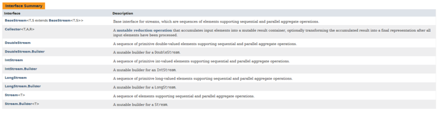

<details>
<summary>Introduction</summary>

Introduces the Stream API.

The following topics are covered:
- Stream creation
  - a) `Stream.of(v1, v2, v3, ...)`
  - b) `List.stream()`
- The Stream interfaces
  - Intermediate operations
  - Terminal operations

The addition of the `Stream` API was one of the major features added to Java 8. A `Stream` in Java can be defined as a sequence of elements from a source that supports aggregate operations on its elements. The source here refers to collections or arrays that provide data to a stream.

A few important points about streams are:
1. A stream is not a data structure itself. It is a bunch of operations applied to a source. The source can be collections, arrays or I/O channels.
2. Streams don’t change the original data structure.
3. There can be zero or more intermediate operations that transform a stream into another stream.
4. Each intermediate operation is lazily executed (This will be discussed later).
5. Terminal operations produce the result of the stream.

### Stream creation

Streams can be created from different element sources, e.g., a collection or an array with the help of `stream()` and `of()` methods. Below are the different ways to create a stream.

### a) `Stream.of(v1, v2, v3, ...)`

In the below example, we are creating a stream of integers using the `Stream.of()` method.

```java
import java.util.stream.Stream;

public class StreamDemo {
    public static void main(String[] args) {
        Stream<Integer> stream = Stream.of(1,2,3,4,5,6,7,8,9);
        stream.forEach(p -> System.out.println(p));
    }
}
```

#### Output

```
1
2
3
4
5
6
7
8
9
```

### b) `List.stream()`

In the below example, we are creating a stream from a `List`.

```java
import java.util.ArrayList;
import java.util.List;
import java.util.stream.Stream;

public class StreamDemo {
    public static void main(String[] args) {
        List<String> list = new ArrayList<>();
        list.add("a");
        list.add("b");
        list.add("c");
        list.add("d");

        Stream<String> stream = list.stream();
        stream.forEach(p -> System.out.println(p));
    }
}
```

#### Output

```
a
b
c
d
```

### The Stream interfaces

The Stream API defines a few interfaces such as `Stream`, `IntStream`, `LongStream`, etc.

The `Stream<T>` interface is for object elements. For primitives, it defines `IntStream`, `LongStream` and `DoubleStream` interfaces.

It is a good practice to use primitive streams if you are dealing with primitives because wrapping primitives to objects and auto-boxing is a costly process.

Below is the complete list of methods defined in Stream API.



The methods defined by these interfaces can be divided into the following two categories:

### Intermediate operations

These methods do not produce any results. They usually accept functional interfaces as parameters and always return a new stream. Some examples of intermediate operations are `filter()`, `map()`, etc.

### Terminal operations

These methods produce some results, e.g., `count()`, `toArray(..)`, and `collect(..)`.

The streams operations can be further classified as:
1. filtering
2. slicing
3. mapping
4. matching and finding
5. reduction
6. collect

This was the basic introduction to streams. In subsequent sections, we will explore each of these operations. We will also look at how these methods are combined to process collections.

---

The next section discusses the filtering operations in `Stream`.

</details>


<details>
<summary>Filtering Operations in Stream</summary>

Discusses filtering operations in `Stream`.

The following topics are covered:
- `filter()` method
- `filter()` with custom object
- `filter()` chaining

The filtering operations filters the given stream and returns a new stream, which contains only those elements that are required for the next operation.

### `filter()` method

The `Stream` interface has a `filter()` method to filter a stream. This is an intermediate operation. Below is the method definition of the `filter()` method.

`Stream filter(Predicate<? super T> predicate)`

**Parameter**: A predicate to apply to each element to determine if it should be included.

**Return Type**: It returns a stream consisting of the elements of this stream that match the given predicate.

```java
import java.util.ArrayList;
import java.util.List;
import java.util.stream.Stream;

public class StreamDemo {
    public static void main(String[] args) {
        //Created a list of integers
        List<Integer> list = new ArrayList<>();
        list.add(1);
        list.add(12);
        list.add(23);
        list.add(45);
        list.add(6);

        list.stream()                           // Created a stream from the list
                .filter(num -> num > 10)        // filter() operation to get only numbers greater than 10
                .forEach(System.out::println);  // Printing each number in the list after filtering.

        // Again, printing the elements of `List` to show that the original list is not modified.
        System.out.println("Original list is not modified");
        list.stream().forEach(System.out::println);
    }
}
```

#### Output

```
12
23
45
Original list is not modified
1
12
23
45
6
```

In the above example, we created a list of integers. We followed the below steps:
1. Create a stream from the list.
2. Apply a `filter()` operation on this stream. We want to print only those numbers which are **greater than 10**, so we add a filter.

Please note that the filter operation *does not modify the original `List`*.

### `filter()` with custom object

Let's look at another example of `filter()` with a custom object.

In the below example, we are using multiple conditions in the filter method.

```java
import java.util.ArrayList;
import java.util.List;

public class StreamDemo {
    public static void main(String[] args) {
        List<Person> list = new ArrayList<>();  // Create a list of Person object.
        list.add(new Person("Dave", 23));
        list.add(new Person("Joe", 18));
        list.add(new Person("Ryan", 54));
        list.add(new Person("Iyan", 5));
        list.add(new Person("Ray", 63));

        // We are filtering out those persons whose age is more than 18 and less than 60.
        list.stream()
                .filter(person -> person.getAge() > 18 && person.getAge() < 60)
                .forEach(System.out::println);
    }
}

class Person {
    String name;
    int age;

    Person(String name, int age) {
        this.name = name;
        this.age = age;
    }

    public String getName() { return name; }

    public int getAge() { return age; }

    @Override
    public String toString() {
        return "Person{" +
                "name='" + name + '\'' +
                ", age=" + age +
                '}';
    }
}
```

#### Output

```
Person{name='Dave', age=23}
Person{name='Ryan', age=54}
```

In the above example, multiple conditions were used inside the filter.

### `filter()` chaining

In the above example, we wrote all the conditions in a single filter.

We can also chain the filter method to make the code more readable.

```java
import java.util.ArrayList;
import java.util.List;

public class StreamDemo {
    public static void main(String[] args) {
        List<Person> list = new ArrayList<>();
        list.add(new Person("Dave", 23));
        list.add(new Person("Joe", 18));
        list.add(new Person("Ryan", 54));
        list.add(new Person("Iyan", 5));
        list.add(new Person("Ray", 63));

        list.stream()
                .filter(person -> person.getName() != null ) // Filtering the object where name is not null
                .filter(person -> person.getAge() > 18 ) // Filtering the objects where age is greater than 18
                .filter(person -> person.getAge() < 60) // Filtering the objects where age is less than 60
                .forEach(System.out::println);
    }
}

class Person {
    String name;
    int age;

    Person(String name, int age) {
        this.name = name;
        this.age = age;
    }

    public String getName() { return name; }
    public int getAge() { return age; }

    @Override
    public String toString() {
        return "Person{" +
                "name='" + name + '\'' +
                ", age=" + age +
                '}';
    }
}
```

#### Output

```
Person{name='Dave', age=23}
Person{name='Ryan', age=54}
```

---

The next section discusses the mapping operations in `Stream`.

</details>


<details>
<summary>Mapping Operations in Stream</summary>


</details>
