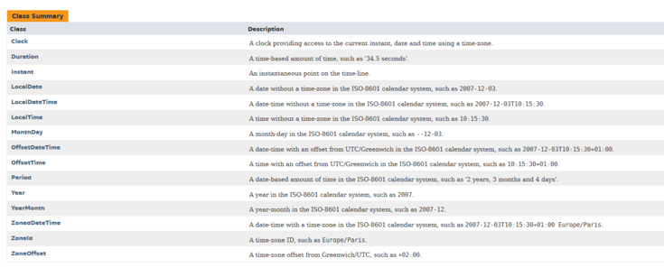

<details>
<summary>Limitations of Old Date/Time API</summary>

Discussion of the limitations of old date and time API.

The following topics are covered:
- Limitations of the old Date/Time API

Java 8 introduced a new Date and Time API, also known as **JSR-310** under the `java.time` package.

It is a very rich API for working with dates and times. Before we look at the features it provides, we should discuss the limitations of the old API.

### Limitations of the old `Date`/`Time` API

Here are the limitations of the old date and time API:
1. The old date class is not Thread Safe. Unlike String or Integer class, it is not immutable. Any thread can get a reference to the Date object and modify its value.
2. Its month numbering is from 0 to 11. This is very confusing and has resulted in many errors.
3. Prior to JDK 8, Java uses String to represent TimeZone. If we need to get the timezone for Hong Kong, then below is the code:

```
TimeZone zone = TimeZone.getInstance(“Asia/Hong_Kong”);
```

There are chances that we might mistakenly write HongKong or make some other spelling errors. There is no check for this in the old API.

4. A `Date` instance represents an instant in time, not a date. This means that the date in the old API will mean both date and time. If we need only time without date then that is not possible.

These were the main limitations that drove the Java developers to introduce a completely new Date/Time API.

---

The next section discusses the newly added `LocalDate` class in the `Date` API.

</details>


<details>
<summary>LocalDate</summary>

Discussion of the `LocalDate` class.

The following topics are covered:
- Getting the current date
- Getting a specific date using `of()` method
- Getting a specific date using `parse()` method
- Adding days and months to a given date
- Getting the day of the week
- Checking if a date is before or after a given date

The new Date and Time API is moved to the `java.time` package and the **Joda** time format is followed.

The classes in the new API are immutable and, hence, thread-safe. The new API contains lots of classes that allow us to have more fine-grained control over our date and time representation.

Below is the list of all the classes in the `java.time` package.



In this lesson, we will look at the `LocalDate` class of the `java.time` package. This class holds only the date part without a time-zone in the **ISO-8601** calendar system. It represents a date in **ISO format** (yyyy-MM-dd).

Let's look at some of the common use cases that can be solved through this class.

### a) Getting the current date

We can get the current date by using the static `now()` method in the `LocalDate` class.

```java
import java.time.LocalDate;

class DateTimeDemo {
    public static void main(String[] args) {
        // now() method will return the current date.
        LocalDate date = LocalDate.now();
        System.out.println(date);
    }
}
```

#### Output

```
2023-01-26
```

### b) Getting a specific date using `of()` method

We can get a specific date by using the static `of()` method in the `LocalDate` class. This method has two overloaded versions.

Each of them is shown in the example below.

```java
import java.time.LocalDate;
import java.time.Month;

class DateTimeDemo {
    public static void main(String[] args) {
        // of(int year, int month, int dayOfMonth)
        LocalDate date = LocalDate.of(2019, 05, 03);
        System.out.println(date);

        // of(int year, Month month, int dayOfMonth)
        date = LocalDate.of(2019, Month.AUGUST, 03);
        System.out.println(date);
    }
}
```

#### Output

```
2019-05-03
2019-08-03
```

### c) Getting a specific date using `parse()` method

We can get a specific date by using the static `parse()` method in the `LocalDate` class. This method has two overloaded versions.

Each of them is shown in the example below.

```java
import java.time.LocalDate;
import java.time.format.DateTimeFormatter;

class DateTimeDemo {
    public static void main(String[] args) {
        // parse(CharSequence text)
        LocalDate date = LocalDate.parse("2015-02-12");
        System.out.println(date);

        // parse(CharSequence text, DateTimeFormatter formatter)
        date = LocalDate.parse("12/02/2012", DateTimeFormatter.ofPattern("MM/dd/yyyy"));
        System.out.println(date);
    }
}
```

#### Output

```
2015-02-12
2012-12-02
```

### d) Adding days and months to a given date

We can use a whole range of addition operation methods that can be used for adding days, weeks, and months to a given date.

```java
import java.time.LocalDate;
import java.time.temporal.ChronoUnit;

class DateTimeDemo {
    public static void main(String[] args) {
        // Adding 4 days to the given date.
        LocalDate date = LocalDate.parse("2015-02-12").plusDays(4);
        System.out.println(date);
         
         // Adding 4 months to the given date.
        date = LocalDate.parse("2015-02-12").plus(4, ChronoUnit.MONTHS);
        System.out.println(date);
    }
}
```

#### Output

```
2015-02-16
2015-06-12
```

### e) Getting the day of the week

We can get the day of the week using `getDayOfWeek()` method.

```java
import java.time.DayOfWeek;
import java.time.LocalDate;

class DateTimeDemo {
    public static void main(String[] args) {
        DayOfWeek dayOfWeek = LocalDate.parse("2017-04-06").getDayOfWeek();
        System.out.println(dayOfWeek);
    }
}
```

#### Output

```
THURSDAY
```

### f) Checking if a date is before or after a given date

We can check if a date comes before or after another given date by using the `isBefore()` and `isAfter()` methods.

```java
import java.time.LocalDate;

class DateTimeDemo {
    public static void main(String[] args) {
        // Using isBefore() to check if the date is before a given date.
        boolean isBefore = LocalDate.parse("2020-03-12")
                .isBefore(LocalDate.parse("2018-06-14"));
        System.out.println(isBefore);

        // Using isAfter() to check if the date is after a given date.
        boolean isAfter = LocalDate.parse("2020-03-12")
                .isAfter(LocalDate.parse("2018-06-14"));
        System.out.println(isAfter);
    }
}
```

#### Output

```
false
true
```

---

This has been a basic introduction to the `LocalDate` class and its utilities. The next section discusses `LocalTime`.

</details>


<details>
<summary>LocalTime</summary>

Discussion of the `LocalTime` class.

The following topics are covered:
- Getting the current time
- Getting a specific time using the `of()` method
- Getting a specific time using the `parse()` method
- Adding seconds, minutes and hours to a given time
- Getting minute from time
- Checking if time is before or after a given time

As per JavaDocs,

<blockquote>“LocalTime is an immutable date-time object that represents a time, often viewed as hour-minute-second. Time is represented to nanosecond precision. For example, the value “13:45.30.123456789” can be stored in a LocalTime”.</blockquote>

In other words, the `LocalTime` represents time without a date. An instance of `LocalTime` can be created from the system clock or by using the `now()`, `parse()` and `of()` methods.

Let's look at some of the utilities provided by this class.

### a) Getting the current time

We can get the current time by using the static `now()` method in the `LocalTime` class.

```java
import java.time.LocalTime;

class DateTimeDemo {
    public static void main(String[] args) {
        LocalTime time = LocalTime.now();
        System.out.println(time);
    }
}
```

#### Output

```
15:58:42.416
```

### b) Getting a specific time using the `of()` method

We can get a specific time by using the static `of()` method in the `LocalTime` class. This method has three overloaded versions.

Each of them is shown in the example below.

```java
import java.time.LocalTime;

class DateTimeDemo {
    public static void main(String[] args) {
        // of(int hour, int minute)
        LocalTime time = LocalTime.of(11, 25);
        System.out.println(time);

        // of(int hour, int minute, int second)
        time = LocalTime.of(11, 25, 03);
        System.out.println(time);

        // of(int hour, int minute, int second, int nanoOfSecond)
        time = LocalTime.of(11, 25, 04, 323);
        System.out.println(time);
    }
}
```

#### Output

```
11:25
11:25:03
11:25:04.000000323
```

### c) Getting a specific time using the `parse()` method

We can get a specific time by using the static `parse()` method in the `LocalTime` class. This method has two overloaded versions.

Each of them is shown in the example below.

```java
import java.time.LocalTime;
import java.time.format.DateTimeFormatter;

class DateTimeDemo {
    public static void main(String[] args) {
        // parse(CharSequence text)
        LocalTime time = LocalTime.parse("08:27");
        System.out.println(time);

        // parse(CharSequence text, DateTimeFormatter formatter)
        time = LocalTime.parse("08:27", DateTimeFormatter.ofPattern("HH:mm"));
        System.out.println(time);
    }
}
```

#### Output

```
08:27
08:27
```

### d) Adding seconds, minutes, and hours to a given time

We can use a whole range of addition operations to add seconds, minutes and hours to a given time.

```java
import java.time.LocalTime;
import java.time.temporal.ChronoUnit;

class DateTimeDemo {
    public static void main(String[] args) {
        // Adding 4 seconds to the given time.
        LocalTime time = LocalTime.parse("12:54:53").plusSeconds(4);
        System.out.println(time);

        // Adding 10 minutes to the given time.
        time = LocalTime.parse("12:54:53").plusMinutes(10);
        System.out.println(time);

        // Adding 2 hours to the given time.
        time = LocalTime.parse("12:54:53").plusHours(2);
        System.out.println(time);

        // Adding 4 minutes to the given time.
        time = LocalTime.parse("12:54:53").plus(4, ChronoUnit.MINUTES);
        System.out.println(time);
    }
}
```

#### Output

```
12:54:57
13:04:53
14:54:53
12:58:53
```

### e) Getting minute from time

We can get the value of minutes using `getMinute()` method.

```java
import java.time.LocalTime;

class DateTimeDemo {
    public static void main(String[] args) {
        int minute = LocalTime.parse("07:45").getMinute();
        System.out.println(minute);
    }
}
```

#### Output

```
45
```

### f) Checking if time is before or after a given time

```java
import java.time.LocalTime;

class DateTimeDemo {
    public static void main(String[] args) {
        boolean isBefore = LocalTime.parse("06:23")
                .isBefore(LocalTime.parse("07:50"));
        System.out.println(isBefore);

        boolean isAfter = LocalTime.parse("06:23")
                .isAfter(LocalTime.parse("07:50"));
        System.out.println(isAfter);
    }
}
```

#### Output

```
true
false
```

---

These are some of the important utilities of the `LocalTime` class. The next section discusses the `LocalDatetime` class.

</details>


<details>
<summary>LocalDateTime</summary>

Discussion of the `LocalDateTime` class and a few of its methods.

The following topics are covered:
- Getting the current date and time
- Getting a specific date and time using the `of()` method
- Getting a specific date and time using the `parse()` method
- Modifying a given date and time

The `LocalDateTime` is used to represent a combination of date and time. The classes that we saw in our previous lessons were intended to return only date or time. This class is used when we need a combination of date and time. This class offers a variety of utilities and we will look at some of the most commonly used ones.

### a) Getting the current date and time

We can get the current date and time by using the static `now()` method in the `LocalDateTime` class.

```java
import java.time.LocalDateTime;

class DateTimeDemo {
    public static void main(String[] args) {
        LocalDateTime date = LocalDateTime.now();
        System.out.println(date);
    }
}
```

#### Output

```
2023-01-26T16:08:58.615
```

### b) Getting a specific date and time using the `of()` method

We can get a specific date and time by using the static `of()` method in the `LocalDateTime` class. This method has two overloaded versions.

Each of them is shown in the example below.

```java
import java.time.LocalDateTime;
import java.time.Month;

class DateTimeDemo {
    public static void main(String[] args) {
        // of(int year, int month, int dayOfMonth, int hour, int minute)
        LocalDateTime date = LocalDateTime.of(2019, 05, 03, 12, 34);
        System.out.println(date);

        // of(int year, int month, int dayOfMonth, int hour, int minute, int second)
        date = LocalDateTime.of(2019, Month.AUGUST, 03, 23, 34);
        System.out.println(date);
    }
}
```

#### Output

```
2019-05-03T12:34
2019-08-03T23:34
```

### c) Getting a specific date and time using the `parse()` method

We can get a specific date and time by using the static `parse()` method in the `LocalDateTime` class.

```java
import java.time.LocalDateTime;

class DateTimeDemo {
    public static void main(String[] args) {
        // parse(CharSequence text)
        LocalDateTime date = LocalDateTime.parse("2020-06-20T07:54:00");
        System.out.println(date);
    }
}
```

#### Output

```
2020-06-20T07:54
```

### d) Modifying a given date and time

We can use a whole range of addition and subtraction operation methods to modify the given `DateTime`.

```java
import java.time.LocalDateTime;
import java.time.temporal.ChronoUnit;

class DateTimeDemo {
    public static void main(String[] args) {
        // Adding 4 days to given date and time.
        LocalDateTime date = LocalDateTime.parse("2020-05-12T08:30:00").plusDays(4);
        System.out.println(date);
         
        // Adding 4 months to given date and time.
        date = LocalDateTime.parse("2020-05-12T08:30:00").plus(4, ChronoUnit.MONTHS);
        System.out.println(date);

        // Subtracting 4 months from given date and time.
        date = LocalDateTime.parse("2020-05-12T08:30:00").minusMonths(4);
        System.out.println(date);
    }
}
```

#### Output

```
2020-05-16T08:30
2020-09-12T08:30
2020-01-12T08:30
```

---

The next section discusses the `ZonedDateTime` class.

</details>


<details>
<summary>ZonedDateTime</summary>

Discussion of the `ZonedDateTime` class and its methods.

The following topics are covered:
- Creating the `ZonedDateTime` instance
- Fetching `Date` and `Time` of a `ZonedDateTime`
- Modifying date and time

The `ZonedDateTime` class represents a date and a time with time zone information. While creating an instance of `ZonedDateTime`, we need to provide a `ZoneId`. The `ZoneId` is an identifier used to represent different zones. Before we proceed towards `ZonedDateTime`, let’s look at `ZoneId` briefly.

The below example shows how to get a `ZoneId` for a given `Zone`.

```java
import java.time.ZoneId;
import java.util.Set;

class DateTimeDemo {
    public static void main(String[] args) {
        //Fetching the Zoneid for given Zone.
        ZoneId zoneId = ZoneId.of("America/Marigot");
        System.out.println("Zone Id " + zoneId);

        //Fetching a Set of all Zoneids
        Set<String> zoneIdList = ZoneId.getAvailableZoneIds();

        for (String zone : zoneIdList) {
            System.out.println(zone);
        }
    }
}
```

#### Output

```
Zone Id America/Marigot
Asia/Aden
America/Cuiaba
Etc/GMT+9
Etc/GMT+8
Africa/Nairobi
America/Marigot
Asia/Aqtau
...
```

(The above **Output** is truncated to conserve space in this document.)

### 1) Creating a `ZonedDateTime` instance

We can create a `ZonedDateTime` instance using the `now()` or `of()` methods.

Below is an example, to show how to create a `ZonedDateTime` object.

```java
import java.time.ZoneId;
import java.time.ZonedDateTime;

class DateTimeDemo {
    public static void main(String[] args) {
        // Fetching the current TimeZone
        ZonedDateTime zonedDateTime = ZonedDateTime.now();
        System.out.println(zonedDateTime);
        // fetching the ZoneId for Canada/Atlantic
        ZoneId zoneId = ZoneId.of("Canada/Atlantic");

        zonedDateTime =
                ZonedDateTime.of(2020, 10, 15, 23, 45, 59, 1234, zoneId);
        System.out.println(zonedDateTime);
    }
}
```

#### Output

```
2023-01-26T16:34:52.633Z[Etc/UTC]
2020-10-15T23:45:59.000001234-03:00[Canada/Atlantic]
```

### Fetching `Date` and `Time` of a `ZonedDateTime`

We can fetch the date and time fields of a `ZonedDateTime` instance using one of the following methods:

- `getYear()`
- `getMonth()`
- `getDayOfMonth()`
- `getDayOfWeek()`
- `getDayOfYear()`
- `getHour()`
- `getMinute()`
- `getSecond()`
- `getNano()`

The example below shows the usage of all these methods.

```java
import java.time.DayOfWeek;
import java.time.Month;
import java.time.ZonedDateTime;

class DateTimeDemo {
    public static void main(String[] args) {
        ZonedDateTime zonedDateTime = ZonedDateTime.now();

        int year = zonedDateTime.getYear();
        System.out.println("Year is: " + year);

        Month month = zonedDateTime.getMonth();
        System.out.println("Month is: " + year);

        int dayOfMonth = zonedDateTime.getDayOfMonth();
        System.out.println("Day Of Month is: " + dayOfMonth);

        DayOfWeek dayOfWeek = zonedDateTime.getDayOfWeek();
        System.out.println("Day of week is: " + dayOfWeek);

        int dayOfYear = zonedDateTime.getDayOfYear();
        System.out.println("Day of year is: " + dayOfYear);

        int hour = zonedDateTime.getHour();
        System.out.println("Hour is: " + hour);

        int minute = zonedDateTime.getMinute();
        System.out.println("Minute is: " + minute);

        int second = zonedDateTime.getSecond();
        System.out.println("Second is: " + second);

        int nano = zonedDateTime.getNano();
        System.out.println("Nano is: " + nano);
    }
}
```

#### Output

```
Year is: 2023
Month is: 2023
Day Of Month is: 26
Day of week is: THURSDAY
Day of year is: 26
Hour is: 16
Minute is: 37
Second is: 16
Nano is: 143000000
```

### 3) Modifying date and time

The `ZonedDateTime` class contains a set of methods used for modifying the date and time. Some of these methods are:

- `plusYears()`
- `plusMonths()`
- `plusDays()`
- `plusHours()`
- `plusMinutes()`
- `plusSeconds()`
- `plusNanos()`
- `minusYears()`
- `minusMonths()`
- `minusDays()`
- `minusHours()`
- `minusMinutes()`
- `minusSeconds()`
- `minusNanos()`

The example given below shows the usage of all these methods.

```java
import java.time.ZonedDateTime;

class DateTimeDemo {
    public static void main(String[] args) {
        ZonedDateTime zonedDateTime = ZonedDateTime.now();

        System.out.println("Date after adding Year is: " + zonedDateTime.plusYears(1));

        System.out.println("Date after adding Month is: " + zonedDateTime.plusMonths(1));

        System.out.println("Date after adding days is: " + zonedDateTime.plusDays(15));

        System.out.println("Date after adding hours is: " + zonedDateTime.plusHours(15));

        System.out.println("Date after adding minutes is: " + zonedDateTime.plusMinutes(1));

        System.out.println("Date after adding seconds is: " + zonedDateTime.plusSeconds(15));

        System.out.println("Date after adding nanoseconds is: " + zonedDateTime.plusNanos(15));

        System.out.println("Date after subtracting Year is: " + zonedDateTime.minusYears(1));

        System.out.println("Date after subtractng Month is: " + zonedDateTime.minusMonths(1));

        System.out.println("Date after subtracting days is: " + zonedDateTime.minusDays(15));

        System.out.println("Date after subtracting hours is: " + zonedDateTime.minusHours(15));

        System.out.println("Date after subtracting minutes is: " + zonedDateTime.minusMinutes(1));

        System.out.println("Date after subtracting seconds is: " + zonedDateTime.minusSeconds(15));

        System.out.println("Date after subtracting nanoseconds is: " + zonedDateTime.minusNanos(15));
    }
}
```

#### Output

```
Date after adding Year is: 2024-01-26T16:39:16.694Z[Etc/UTC]
Date after adding Month is: 2023-02-26T16:39:16.694Z[Etc/UTC]
Date after adding days is: 2023-02-10T16:39:16.694Z[Etc/UTC]
Date after adding hours is: 2023-01-27T07:39:16.694Z[Etc/UTC]
Date after adding minutes is: 2023-01-26T16:40:16.694Z[Etc/UTC]
Date after adding seconds is: 2023-01-26T16:39:31.694Z[Etc/UTC]
Date after adding nanoseconds is: 2023-01-26T16:39:16.694000015Z[Etc/UTC]
Date after subtracting Year is: 2022-01-26T16:39:16.694Z[Etc/UTC]
Date after subtractng Month is: 2022-12-26T16:39:16.694Z[Etc/UTC]
Date after subtracting days is: 2023-01-11T16:39:16.694Z[Etc/UTC]
Date after subtracting hours is: 2023-01-26T01:39:16.694Z[Etc/UTC]
Date after subtracting minutes is: 2023-01-26T16:38:16.694Z[Etc/UTC]
Date after subtracting seconds is: 2023-01-26T16:39:01.694Z[Etc/UTC]
Date after subtracting nanoseconds is: 2023-01-26T16:39:16.693999985Z[Etc/UTC]
```

---

The next section discusses the `Period` and `Duration` classes.

</details>